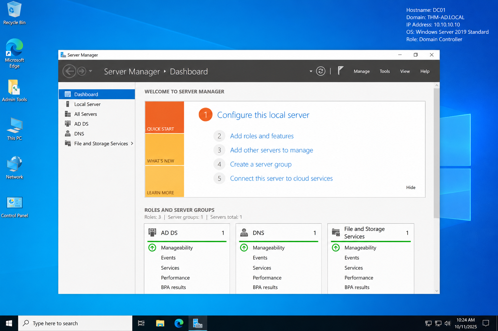
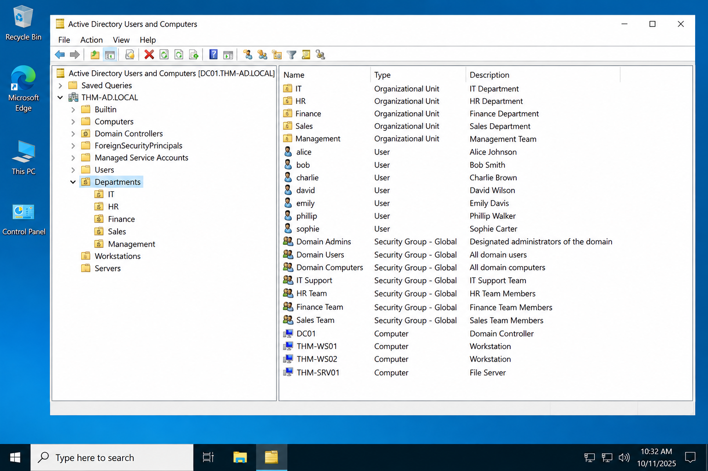
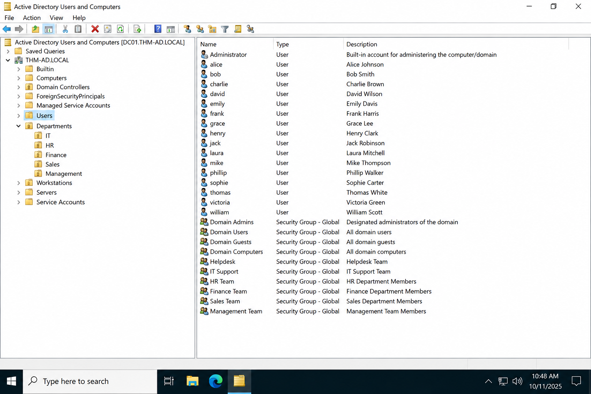
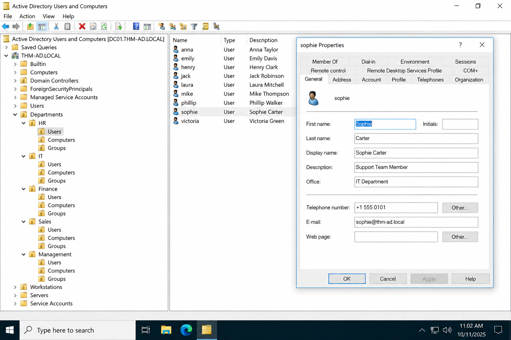
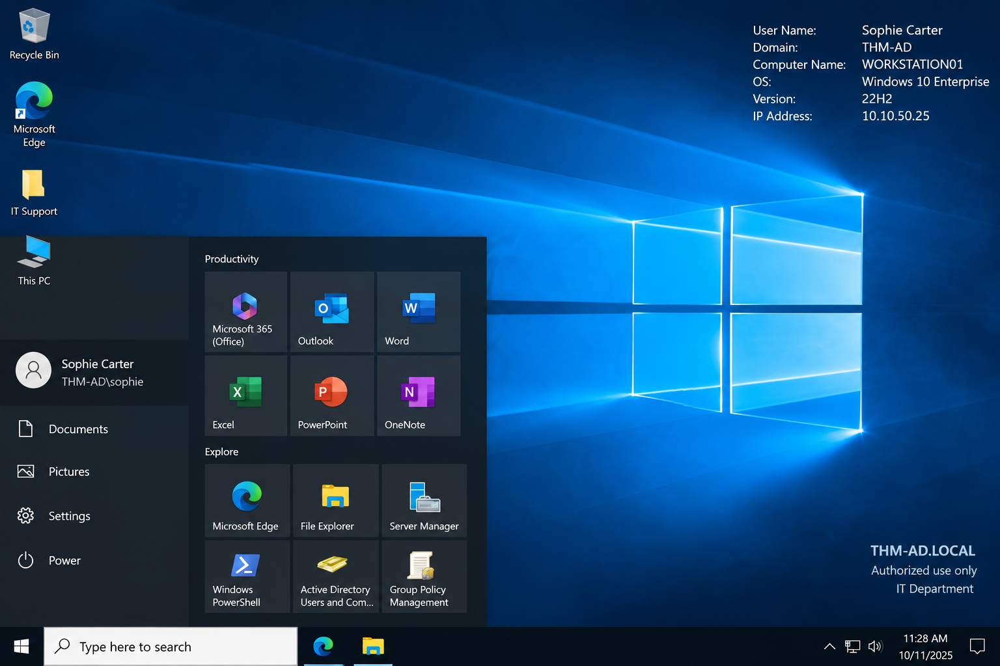
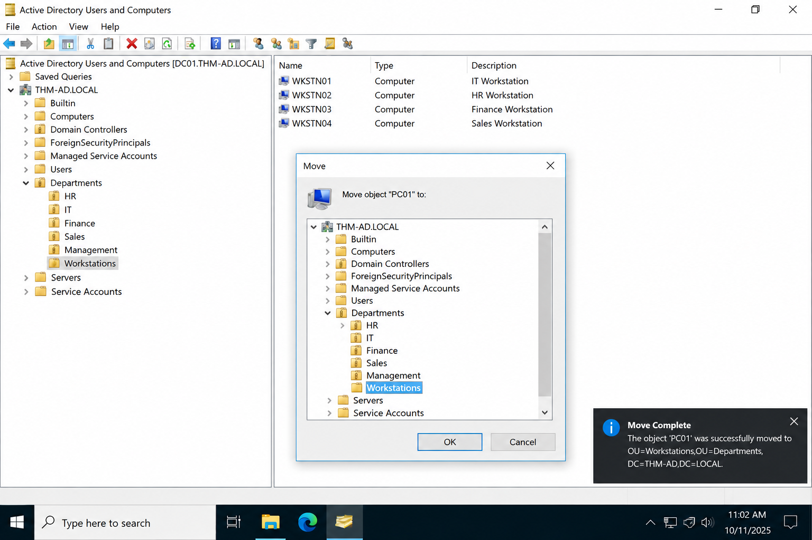
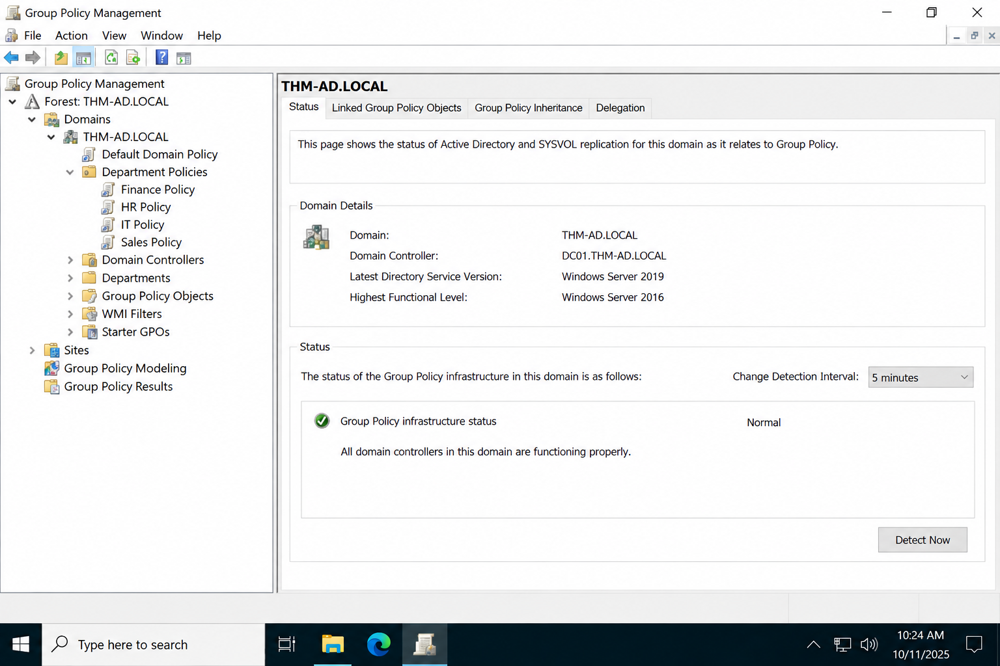
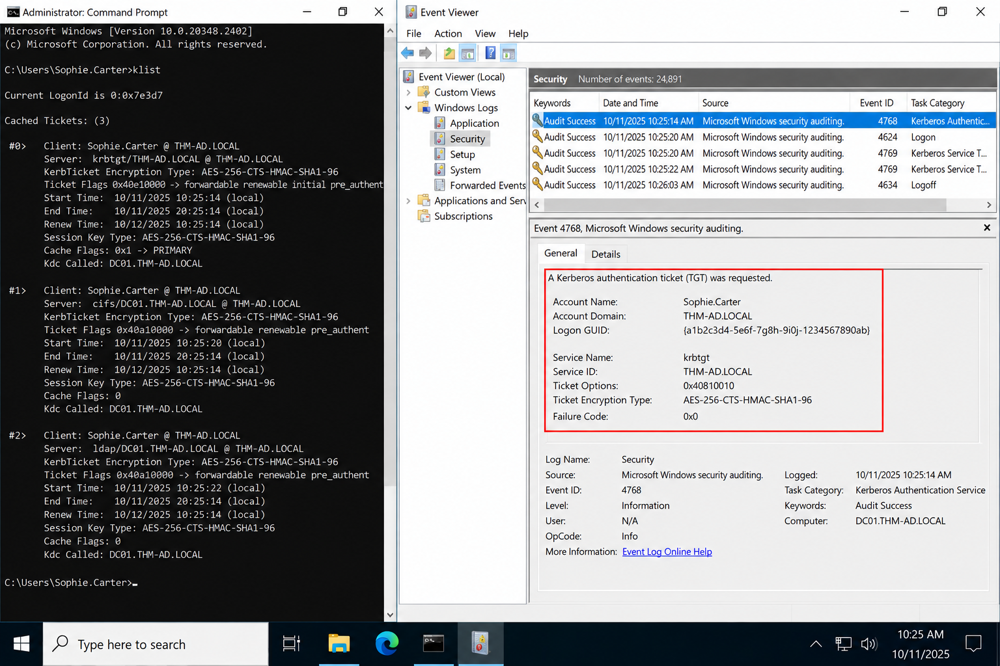
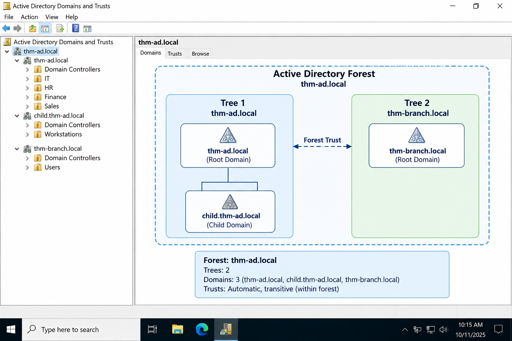

# 🛡️ Active Directory Basics — TryHackMe Lab Documentation

> **Platform:** TryHackMe  
> **Room:** Active Directory Basics  
> **Focus:** Windows Domains • Active Directory • User & Computer Administration • GPO • SYSVOL • Kerberos • Trust Relationships

---

## 📌 Executive Summary

This repository documents my hands-on work through the **Active Directory Basics** room on **TryHackMe**.

The lab provided practical exposure to the structure and administration of a Windows Active Directory environment. I worked with core directory objects, explored Organizational Units, performed user and computer administration, reviewed Group Policy concepts, examined SYSVOL, and studied the authentication and trust mechanisms used in enterprise Windows domains.

The purpose of this documentation is to record **what I learned, what I performed, and how the environment was managed**, rather than publish challenge solutions.

> **Ethical / Educational Notice**
>
> Challenge flags, passwords, credentials, and direct challenge answers are intentionally omitted or represented as **`[REDACTED]`**. This repository is intended for educational and portfolio use.

---

## 📑 Table of Contents

- [1. Learning Objectives](#1-learning-objectives)
- [2. Lab Environment](#2-lab-environment)
- [3. Active Directory Fundamentals](#3-active-directory-fundamentals)
- [4. Task 2 — Windows Domains](#4-task-2--windows-domains)
- [5. Task 3 — Active Directory Objects](#5-task-3--active-directory-objects)
- [6. Task 4 — Managing Users](#6-task-4--managing-users)
- [7. Task 5 — Managing Computers](#7-task-5--managing-computers)
- [8. Task 6 — Group Policy and SYSVOL](#8-task-6--group-policy-and-sysvol)
- [9. Task 7 — Authentication](#9-task-7--authentication)
- [10. Task 8 — Trees, Forests and Trusts](#10-task-8--trees-forests-and-trusts)
- [11. Tools and Commands](#11-tools-and-commands)
- [12. Security Observations](#12-security-observations)
- [13. Skills Demonstrated](#13-skills-demonstrated)
- [14. Key Takeaways](#14-key-takeaways)
- [15. Repository Structure](#15-repository-structure)
- [16. Disclaimer](#16-disclaimer)

---

# 1. Learning Objectives

The primary objectives of the lab were to:

- Understand **Windows Domains** and **Active Directory**.
- Identify the role of a **Domain Controller**.
- Explore **users, groups, computers, and machine accounts**.
- Understand how **Organizational Units (OUs)** structure an enterprise directory.
- Perform basic **user administration**.
- Create and organize a **Workstations OU**.
- Understand **Group Policy Objects (GPOs)** and **SYSVOL**.
- Compare **Kerberos** and **NetNTLM** authentication.
- Understand **Trees, Forests, and Trust Relationships**.

---

# 2. Lab Environment

| Component | Details |
|---|---|
| **Platform** | TryHackMe |
| **Room** | Active Directory Basics |
| **Environment** | Windows Active Directory Domain |
| **Primary System** | Windows Server / Domain Controller |
| **Access Method** | Remote Desktop Protocol (RDP) |
| **Administrative Console** | Active Directory Users and Computers (ADUC) |
| **Command-Line Tool** | Windows PowerShell |
| **Policy Management** | Group Policy Management |
| **Authentication Concepts** | Kerberos, NetNTLM |
| **Documentation Goal** | Administrative and conceptual learning |

---

# 3. Active Directory Fundamentals

## 3.1 What is Active Directory?

**Active Directory (AD)** is Microsoft's directory service for Windows domain environments. It provides centralized management of identities, computers, groups, and other network resources.

Instead of independently managing every machine and account, an organization can use a domain to centralize authentication, authorization, administration, and policy.

### Core functions

- Identity management
- Authentication
- Authorization
- Centralized administration
- Group-based access control
- Policy enforcement

---

## 3.2 Domain Controller

A **Domain Controller (DC)** is a Windows Server system running **Active Directory Domain Services (AD DS)**.

It is responsible for services such as:

- Authenticating users and computers
- Managing directory objects
- Supporting Kerberos authentication
- Providing directory queries
- Hosting SYSVOL
- Participating in directory replication
- Working with DNS for domain service discovery

---

## 3.3 Active Directory Object Model

The lab introduced the main object types used in a Windows domain.

| Object | Purpose |
|---|---|
| **User** | Represents an identity within the domain |
| **Group** | Organizes accounts for permission and access management |
| **Computer** | Represents a domain-joined endpoint |
| **Organizational Unit** | Logical container used for administration and policy application |
| **Domain Controller** | Provides directory and authentication services |

---

# 4. Task 2 — Windows Domains

## Objective

Understand the relationship between a Windows Domain, Active Directory, and the Domain Controller.

A Windows domain provides a centralized administrative boundary for users, computers, and network resources.

The domain model makes it possible for administrators to manage identities and policies consistently across many systems.

### What I performed

1. Connected to the Windows lab environment.
2. Identified the Domain Controller role.
3. Reviewed how centralized authentication differs from local account management.
4. Established the relationship between the domain and Active Directory.

### Practical takeaway

The key concept from this stage was **centralized identity management**. A user identity can be managed centrally and used across domain-joined resources according to the permissions assigned to that account.

### 📷 Figure 2.1 — Windows Domain Environment



*The screenshot shows the Windows Server environment used as the administrative context for the Active Directory lab.*

---

# 5. Task 3 — Active Directory Objects

## Objective

Explore the directory hierarchy and understand how users, groups, computers, and Organizational Units are organized.

## 5.1 Active Directory Users and Computers

The **Active Directory Users and Computers (ADUC)** console provides a graphical interface for managing many common directory objects.

During the lab, I used ADUC to:

1. Navigate the domain hierarchy.
2. Inspect existing Organizational Units.
3. Review user accounts.
4. Review computer objects.
5. Understand where policies and delegated administration can be applied.

### 📷 Figure 3.1 — Active Directory Users and Computers Console



*The ADUC console provides a hierarchical view of the domain and its objects.*

---

## 5.2 Organizational Unit Structure

An **Organizational Unit (OU)** is a logical container used to group directory objects.

OUs are particularly useful for:

- Policy targeting
- Delegated administration
- Departmental organization
- Separating administrative responsibilities
- Structuring workstations and servers

A well-designed OU hierarchy makes enterprise administration easier to scale.

### 📷 Figure 3.2 — Organizational Unit Structure


*The screenshot demonstrates the hierarchical arrangement of departmental and infrastructure OUs.*

---

## 5.3 Domain Users Container

The domain's user container provides visibility into available user identities and related directory objects.

During the exercise, I reviewed the available accounts and distinguished user objects from security groups and other object types.

### 📷 Figure 3.3 — Domain Users Container



*The screenshot shows the available user objects within the Active Directory environment.*

---

# 6. Task 4 — Managing Users

## Objective

Perform a controlled user-management operation using administrative privileges.

## 6.1 User Account Management

The administrative workflow was:

1. Connect to the Domain Controller through RDP.
2. Open **Active Directory Users and Computers**.
3. Navigate to the appropriate OU.
4. Locate the target user.
5. Review the account properties.
6. Perform the required administrative action.
7. Verify the resulting account state.

### 📷 Figure 4.1 — Active Directory User Account Management



*The screenshot shows the target account selected within ADUC and its administrative properties.*

---

## 6.2 Password Reset Using PowerShell

PowerShell provides command-line access to Active Directory administration.

A password reset was performed using the Active Directory PowerShell module.

```powershell
Set-ADAccountPassword -Identity <username> -Reset
```

The actual password used in the lab is intentionally **not documented**.

```text
Password: [REDACTED]
```

### Administrative reasoning

Using PowerShell makes the operation:

- Repeatable
- Auditable
- Scriptable
- Suitable for administrative workflows

### 📷 Figure 4.2 — Password Reset Using PowerShell


*The screenshot shows the PowerShell-based account administration workflow. Sensitive credentials are not included in this repository.*

---

## 6.3 Login Verification

After the account operation, the updated account was used to verify that the administrative change had been applied successfully.

The verification step demonstrated the relationship between directory administration and user authentication.

### 📷 Figure 4.3 — Successful User Login Verification



*The screenshot confirms successful authentication into the Windows environment using the managed domain account.*

> **Challenge Data:** `[REDACTED]`

---

# 7. Task 5 — Managing Computers

## Objective

Organize computer objects into a dedicated **Workstations** Organizational Unit.

Separating workstation systems from servers improves administrative control and makes targeted Group Policy deployment easier.

## 7.1 Creating the Workstations OU

The new OU was created inside the appropriate directory hierarchy.

### Procedure

1. Open **Active Directory Users and Computers**.
2. Select the desired parent container.
3. Create a new Organizational Unit.
4. Assign the name `Workstations`.
5. Confirm the new OU appears in the directory hierarchy.

### 📷 Figure 5.1 — Creating the Workstations Organizational Unit


*The screenshot shows the creation of the dedicated Workstations OU.*

---

## 7.2 Moving Computer Objects

After creating the OU, workstation computer objects were moved into it.

### Procedure

1. Locate workstation computer objects.
2. Select the objects that belong to the workstation category.
3. Use the **Move** operation.
4. Select the newly created **Workstations** OU.
5. Confirm the move.
6. Verify the objects appear under the new OU.

### 📷 Figure 5.2 — Moving Computer Objects into the OU



*The screenshot demonstrates moving a workstation computer object into the dedicated Workstations OU.*

---

## 7.3 Why Separate Workstations and Servers?

Keeping server and workstation objects in separate OUs allows administrators to target different policies and administrative controls.

| Workstations | Servers |
|---|---|
| Endpoint configuration | Server configuration |
| User-centric restrictions | Infrastructure controls |
| Desktop security policies | Service and role-specific policies |
| Endpoint software policies | Server hardening policies |

---

# 8. Task 6 — Group Policy and SYSVOL

## Objective

Understand how centralized policies are defined and distributed throughout a Windows domain.

## 8.1 Group Policy Objects

A **Group Policy Object (GPO)** is a collection of configuration settings that can be applied to users and computers.

Examples include:

- Security settings
- Firewall configuration
- Desktop restrictions
- Password-related controls
- Windows Update policies
- Administrative templates
- Logon scripts

### Policy scope

GPOs can be associated with:

- Sites
- Domains
- Organizational Units

---

## 8.2 Group Policy Management Console

The **Group Policy Management Console (GPMC)** provides a centralized interface for viewing domains, OUs, GPOs, inheritance, and delegation.

### 📷 Figure 6.1 — Group Policy Management Console



*The screenshot shows the Group Policy Management environment used to inspect domain-level policy relationships.*

---

## 8.3 SYSVOL

**SYSVOL** is a shared directory maintained by Domain Controllers and is closely associated with Group Policy distribution.

It contains domain policy data and related files used by domain-joined systems.

A typical local path is:

```text
C:\Windows\SYSVOL\sysvol\
```

### 📷 Figure 6.2 — SYSVOL Directory


*The screenshot shows the SYSVOL directory and its role in the domain's Group Policy infrastructure.*

---

# 9. Task 7 — Authentication

## Objective

Understand how Windows domain authentication works and how Kerberos differs from NetNTLM.

## 9.1 Kerberos

Kerberos is the preferred authentication protocol in modern Windows domains.

The important components are:

| Component | Role |
|---|---|
| **KDC** | Key Distribution Center |
| **AS** | Authentication Service |
| **TGT** | Ticket Granting Ticket |
| **TGS** | Ticket Granting Service |

### Simplified flow

```text
User
  │
  ▼
Authentication Service
  │
  ▼
TGT
  │
  ▼
Ticket Granting Service
  │
  ▼
Service Ticket
  │
  ▼
Requested Resource
```

A **TGT** allows the authenticated user to request additional service tickets.

---

## 9.2 NetNTLM

NetNTLM uses a challenge-response mechanism and is maintained primarily for compatibility with systems or scenarios where Kerberos is not used.

The user's plaintext password is not simply transmitted across the network as part of the authentication exchange.

---

## 9.3 Authentication Verification

The lab environment was used to observe Windows authentication-related information and understand the relationship between a domain account, Kerberos tickets, and Domain Controller services.

### 📷 Figure 7.1 — Windows Authentication Concepts



*The screenshot provides a practical view of Kerberos-related authentication activity and Windows security logging.*

---

# 10. Task 8 — Trees, Forests and Trusts

## Objective

Understand how Active Directory scales beyond a single domain.

## 10.1 Domain

A **Domain** is an administrative and security boundary containing directory objects such as users, computers, and groups.

## 10.2 Tree

A **Tree** is a hierarchical collection of domains that share a contiguous namespace.

Example:

```text
example.local
├── it.example.local
├── hr.example.local
└── sales.example.local
```

## 10.3 Forest

A **Forest** is a collection of one or more Active Directory domain trees that share a common directory configuration and schema.

The forest represents the broader administrative structure of the Active Directory environment.

## 10.4 Trust Relationships

Trust relationships allow identities from one domain to access resources in another domain according to the configured trust direction and permissions.

```text
+-------------------+       Trust       +-------------------+
|     Domain A      | <---------------> |     Domain B      |
|                   |                   |                   |
|   Users / Groups  |                   | Resources / ACLs |
+-------------------+                   +-------------------+
```

### 📷 Figure 8.1 — Active Directory Tree and Forest Structure



*The diagram demonstrates the relationship between domains, trees, forests, and trust relationships.*

---

# 11. Tools and Commands

## 11.1 Active Directory Users and Computers

**ADUC** was the primary graphical administration tool used during the practical portions of the lab.

Typical uses:

- Create and manage users
- Manage groups
- Review computer objects
- Create and organize OUs
- Perform account administration

## 11.2 PowerShell

PowerShell provides a scriptable interface for Windows and Active Directory administration.

Examples used for learning included:

```powershell
Get-ADUser <username>
```

```powershell
Set-ADAccountPassword -Identity <username> -Reset
```

```powershell
Unlock-ADAccount -Identity <username>
```

```powershell
Enable-ADAccount -Identity <username>
```

```powershell
New-ADOrganizationalUnit -Name "Workstations"
```

> **Note:** Commands shown here are generic examples. Lab credentials and challenge-specific sensitive values are intentionally excluded.

---

# 12. Security Observations

## 12.1 Principle of Least Privilege

Users and administrators should receive only the permissions required to perform their responsibilities.

Delegating permissions to a specific OU is preferable to granting unnecessary domain-wide administrative rights.

## 12.2 OU Design

A well-structured OU hierarchy makes it easier to:

- Scope GPOs
- Delegate permissions
- Separate administrative responsibilities
- Manage endpoints at scale

## 12.3 Group Policy Security

Because GPOs can affect large numbers of systems, unauthorized modification of Group Policy can have significant security consequences.

GPO changes should therefore be:

- Restricted
- Audited
- Reviewed
- Tested before broad deployment

## 12.4 Authentication Security

Kerberos should generally be preferred over legacy authentication mechanisms where supported.

Security teams should monitor:

- Unusual authentication patterns
- Repeated failed logons
- Privileged account activity
- Suspicious ticket activity
- Unexpected changes to sensitive groups

## 12.5 Privileged Account Protection

High-privilege groups should be minimized and closely monitored.

Examples include:

- Domain Admins
- Enterprise Admins
- Built-in Administrators

---

# 13. Skills Demonstrated

### 🖥️ Windows / Active Directory

- Active Directory Users and Computers
- User administration
- Computer object administration
- Organizational Unit design
- Group Policy concepts
- SYSVOL awareness
- Domain architecture

### 🔐 Identity and Access Management

- Authentication
- Authorization
- Delegation
- Group-based access control
- Least privilege

### ⚙️ PowerShell

- Active Directory command usage
- User account administration
- Password management
- Account-state verification

### 🛡️ Cybersecurity

- Windows domain security fundamentals
- Kerberos authentication
- NetNTLM awareness
- Policy management
- Enterprise identity architecture

---

# 14. Key Takeaways

The lab provided practical exposure to the operational side of Active Directory rather than focusing only on theory.

The main lessons were:

1. **Active Directory centralizes identity management** across Windows domains.
2. **Domain Controllers** provide critical authentication and directory services.
3. **Users, groups, computers, and OUs** form the core organizational structure of the directory.
4. **Delegation** allows administrators to grant narrowly scoped permissions.
5. **GPOs and SYSVOL** provide centralized configuration and policy distribution.
6. **Kerberos** is the primary ticket-based authentication mechanism in modern Windows domains.
7. **Trees, forests, and trusts** enable Active Directory to scale across organizational boundaries.
8. Proper **OU design and least-privilege administration** are important security controls.

---

# 15. Repository Structure

```text
Active-Directory-Basics-TryHackMe/
│
├── README.md
│
├── Documentation/
│   └── Documentation.md
│
├── Screenshots/
│   ├── figure-2.1-windows-domain-environment.png
│   ├── figure-3.1-active-directory-users-and-computers.png
│   ├── figure-3.2-organizational-unit-structure.png
│   ├── figure-3.3-domain-users-container.png
│   ├── figure-4.1-user-account-management.png
│   ├── figure-4.2-password-reset-powershell.png
│   ├── figure-4.3-successful-user-login-verification.png
│   ├── figure-5.1-creating-workstations-ou.png
│   ├── figure-5.2-moving-computer-objects.png
│   ├── figure-6.1-group-policy-management-console.png
│   ├── figure-6.2-sysvol-directory.png
│   ├── figure-7.1-windows-authentication-concepts.png
│   └── figure-8.1-active-directory-tree-and-forest-structure.png
│
└── Resources/
    └── notes.md
```

> **Screenshot naming note:** The Markdown links above use a consistent descriptive naming convention. Keep those names, or change each image link to the exact filename already present in your `Screenshots/` directory.

---

# 16. Disclaimer

This repository is intended for **educational and portfolio purposes**.

- No TryHackMe flags are published.
- Passwords and credentials are intentionally omitted.
- Challenge-specific sensitive information has been redacted.
- The content focuses on concepts, administrative procedures, and lessons learned.
- Security techniques are discussed for defensive and educational awareness.

---

<div align="center">

### 🛡️ Active Directory Basics — TryHackMe

**Windows Administration • Active Directory • IAM • GPO • Kerberos**

*Documented for learning and cybersecurity portfolio development.*

</div>
