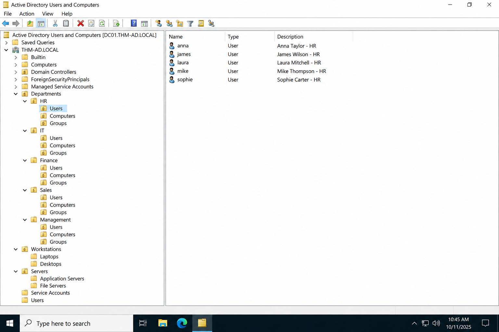
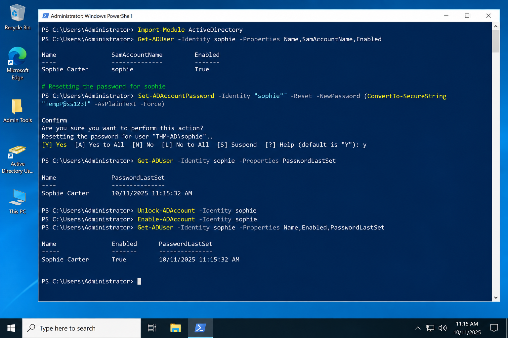
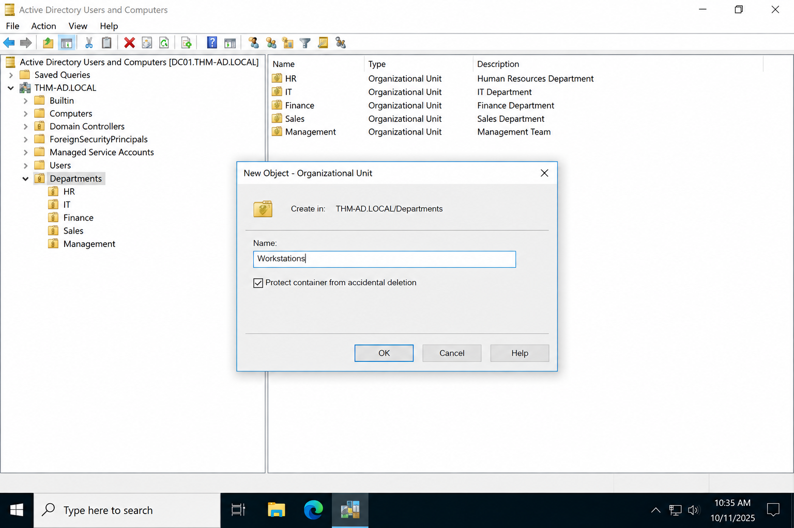
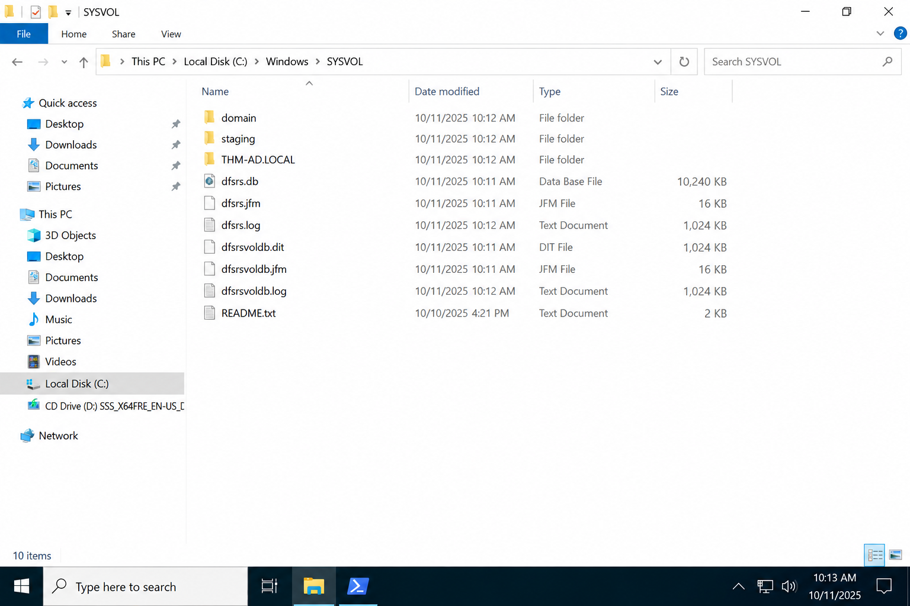

<p align="center">

</p>

<h1 align="center">🛡️ Active Directory Basics — TryHackMe</h1>

<p align="center">
Windows Active Directory Fundamentals • Identity & Access Management • Kerberos • Group Policy
</p>

<p align="center">


</p>

---

## 📖 About This Documentation

This documentation records my practical completion of the **Active Directory Basics** room on **TryHackMe**.

Rather than publishing challenge answers, this repository documents the concepts learned, administrative operations performed, and Windows Active Directory fundamentals explored throughout the lab. The room introduces how enterprise Windows domains are structured and how administrators manage identities, computers, policies, and authentication inside an Active Directory environment.

> **Educational Notice**
>
> This repository is created solely for educational and portfolio purposes.
>
> - Challenge flags have been removed.
> - Passwords and credentials have been redacted.
> - No challenge answers are published.

---

# 📑 Table of Contents

- [1. Learning Objectives](#1-learning-objectives)
- [2. Lab Environment](#2-lab-environment)
- [3. Active Directory Fundamentals](#3-active-directory-fundamentals)
- [4. Task 2 — Windows Domains](#4-task-2--windows-domains)
- [5. Task 3 — Active Directory Objects](#5-task-3--active-directory-objects)
- [6. Task 4 — Managing Users](#6-task-4--managing-users)
- [7. Task 5 — Managing Computers](#7-task-5--managing-computers)
- [8. Task 6 — Group Policy Objects & SYSVOL](#8-task-6--group-policy-objects--sysvol)
- [9. Task 7 — Authentication](#9-task-7--authentication)
- [10. Task 8 — Trees, Forests & Trust Relationships](#10-task-8--trees-forests--trust-relationships)
- [11. PowerShell Commands Used](#11-powershell-commands-used)
- [12. Security Best Practices Learned](#12-security-best-practices-learned)
- [13. Skills Demonstrated](#13-skills-demonstrated)
- [14. Key Takeaways](#14-key-takeaways)
- [15. References](#15-references)

---

# 1. Learning Objectives

The objective of this room was to understand the foundational building blocks of **Microsoft Active Directory** and perform common administrative operations inside a Windows domain.

## Objectives Completed

- ✅ Understand Windows Domains.
- ✅ Understand the purpose of Active Directory Domain Services.
- ✅ Explore Domain Controllers and centralized authentication.
- ✅ Navigate Active Directory Users and Computers (ADUC).
- ✅ Understand Users, Groups, Computers, and Machine Accounts.
- ✅ Create and organize Organizational Units.
- ✅ Perform user administration using ADUC and PowerShell.
- ✅ Understand Group Policy Objects and SYSVOL.
- ✅ Learn Kerberos and NetNTLM authentication.
- ✅ Understand Trees, Forests, and Trust Relationships.

---

# 2. Lab Environment

| Component | Details |
|-----------|---------|
| **Platform** | TryHackMe |
| **Room** | Active Directory Basics |
| **Operating System** | Windows Server |
| **Environment Type** | Windows Active Directory Domain |
| **Access Method** | Remote Desktop Protocol (RDP) |
| **Administrative Tools** | Active Directory Users and Computers, Windows PowerShell |
| **Policy Tool** | Group Policy Management Console |
| **Authentication** | Kerberos & NetNTLM |
| **Skill Category** | Windows Administration / Blue Team Fundamentals |

---

## Technologies Used

| Technology | Purpose |
|------------|---------|
| Active Directory Domain Services | Identity Management |
| Domain Controller | Authentication & Authorization |
| Organizational Units | Logical Administration |
| Group Policy Objects | Security Policy Deployment |
| SYSVOL | Group Policy Distribution |
| PowerShell | Administrative Automation |
| Kerberos | Ticket-Based Authentication |

---

# 3. Active Directory Fundamentals

## 3.1 What is Active Directory?

**Active Directory (AD)** is Microsoft's centralized directory service used in Windows enterprise environments. It stores information about identities, computers, groups, printers, shared resources, and security policies in a structured database.

Instead of maintaining separate local accounts on each computer, organizations authenticate users against a centralized Domain Controller.

### Core Responsibilities of Active Directory

| Function | Description |
|----------|-------------|
| Authentication | Verifies user and computer identities. |
| Authorization | Determines permissions after authentication. |
| Identity Management | Stores users, computers, groups, and policies. |
| Policy Enforcement | Applies Group Policy Objects across the domain. |
| Resource Management | Controls access to shared network resources. |

---

## 3.2 Windows Domains

A **Windows Domain** is an administrative boundary containing users, computers, servers, groups, and policies managed through Active Directory.

### Benefits of a Windows Domain

- Centralized identity management.
- Single Sign-On (SSO).
- Consistent security policies.
- Simplified administration.
- Scalable enterprise infrastructure.

### Domain Workflow

```text
          User Login
               │
               ▼
      Domain Controller (AD DS)
               │
     Authentication & Authorization
               │
               ▼
    Domain Resources & Services
```

---

## 3.3 Domain Controller

A **Domain Controller (DC)** is a Windows Server running **Active Directory Domain Services (AD DS)**.

The Domain Controller acts as the central authority for authentication and directory management.

### Responsibilities of a Domain Controller

- Authenticate users.
- Authenticate computers.
- Store Active Directory database.
- Host SYSVOL.
- Provide Kerberos tickets.
- Work with DNS.
- Replicate directory information.

### Services Running on the Domain Controller

| Service | Purpose |
|---------|---------|
| AD DS | Directory Services |
| DNS | Service Discovery |
| Kerberos KDC | Authentication |
| LDAP | Directory Queries |
| SYSVOL | Policy Distribution |
| NetLogon | Domain Authentication |

---

## 3.4 Active Directory Objects

Active Directory stores multiple object types.

| Object | Description |
|--------|-------------|
| **Users** | Employee or service identities. |
| **Groups** | Collections of identities for permission management. |
| **Computers** | Domain-joined workstations and servers. |
| **Machine Accounts** | Identity assigned to each joined computer. |
| **Organizational Units** | Administrative containers. |
| **Printers / Shares** | Network resources managed by AD. |

---

## 3.5 Organizational Units (OUs)

Organizational Units are logical containers used to organize Active Directory objects.

### Why OUs are Important

- Apply Group Policies.
- Delegate permissions.
- Organize departments.
- Separate workstations from servers.
- Improve scalability.

Example enterprise OU hierarchy:

```text
THM-AD.LOCAL
│
├── HR
├── IT
├── Finance
├── Sales
├── Management
│
├── Workstations
├── Servers
├── Service Accounts
└── Domain Controllers
```

> **Best Practice**
>
> Use Organizational Units to separate resources based on administration and security requirements rather than physical location alone.

---

# 4. Task 2 — Windows Domains

## Objective

Understand how Windows Domains centralize authentication and resource management through Active Directory.

### Practical Activity

During this task I explored the Windows Server environment acting as the Domain Controller and identified the services responsible for centralized authentication.

### What I Learned

- Credentials are stored inside Active Directory.
- Authentication is performed by the Domain Controller.
- Domain users can authenticate across multiple domain-joined machines.
- Policies are centrally managed instead of configured individually.

### Windows Domain Architecture

| Component | Role in the Domain |
|-----------|--------------------|
| Domain Controller | Identity provider |
| Active Directory | Central directory database |
| DNS | Finds domain services |
| Client Workstations | Authenticate against the DC |
| Group Policy | Applies centralized configuration |

---

## 📷 Figure 2.1 — Windows Domain Environment


*Windows Server Domain Controller environment used throughout the Active Directory lab. The server hosts Active Directory Domain Services and administrative management tools.*

---

## Key Concept Learned

A Windows Domain allows administrators to manage hundreds or thousands of devices through a centralized authentication infrastructure instead of maintaining independent local accounts.

> **Security Insight**
>
> Centralized authentication improves auditing, access control, password policy enforcement, and administrative consistency across enterprise Windows environments.

---

# 5. Task 3 — Active Directory Objects

## Objective

Explore the structure of Active Directory and understand how directory objects such as users, groups, computers, and Organizational Units are organized within a Windows Domain.

This task introduced **Active Directory Users and Computers (ADUC)**, the primary Microsoft Management Console (MMC) snap-in used for day-to-day administration of Active Directory.

---

## 5.1 Active Directory Users and Computers (ADUC)

**Active Directory Users and Computers (ADUC)** provides a graphical interface for managing directory objects within a Windows domain.

Using ADUC, administrators can:

- Create and delete user accounts.
- Manage security groups.
- Organize Organizational Units (OUs).
- Join and manage computer objects.
- Reset passwords.
- Delegate administrative permissions.

### Administrative Tasks Performed

During the lab, I:

1. Opened **Active Directory Users and Computers** from the Domain Controller.
2. Navigated through the domain hierarchy.
3. Explored built-in containers and Organizational Units.
4. Identified users, groups, and computers managed by Active Directory.

---

## 📷 Figure 3.1 — Active Directory Users and Computers Console


*The Active Directory Users and Computers console displaying the THM-AD.LOCAL domain hierarchy, Organizational Units, users, groups, and computer containers.*

---

### Understanding the ADUC Interface

| Interface Component | Purpose |
|---------------------|---------|
| **Domain Tree** | Displays the hierarchical structure of the Active Directory domain. |
| **Organizational Units** | Logical containers for grouping directory objects. |
| **Users Container** | Stores user objects and security groups. |
| **Computers Container** | Stores newly joined domain computers by default. |
| **Details Pane** | Displays selected directory objects and their properties. |

---

## 5.2 Organizational Unit Structure

### What is an Organizational Unit?

An **Organizational Unit (OU)** is a logical container inside Active Directory that groups users, computers, groups, and other objects based on administrative or organizational requirements.

Unlike security groups, OUs primarily exist for:

- Administrative delegation.
- Applying Group Policy Objects.
- Structuring enterprise resources.

### Why Organizations Use OUs

- Separate departments (HR, Finance, IT, Sales).
- Separate servers from workstations.
- Delegate permissions to IT support teams.
- Apply department-specific security policies.

### Example Enterprise OU Design

```text
THM-AD.LOCAL
│
├── Management
├── Finance
├── HR
├── IT
├── Sales
│
├── Workstations
├── Servers
├── Service Accounts
└── Domain Controllers
```

### Administrative Observation

The lab environment already contained departmental Organizational Units representing different parts of the organization.

Each department could receive its own policies and delegated administrative permissions.

---

## 📷 Figure 3.2 — Organizational Unit Structure



*Organizational Units grouped departmental users and resources into a logical administrative hierarchy.*

---

> **Best Practice**
>
> Organize Active Directory based on administrative responsibilities rather than organizational charts alone. Separate infrastructure resources such as servers, service accounts, and workstations into dedicated OUs whenever possible.

---

## 5.3 Domain Users Container

### Understanding User Objects

User objects represent identities inside the Windows domain.

Each user account contains multiple attributes including:

| Attribute | Description |
|-----------|-------------|
| Username | User logon identity. |
| Display Name | Friendly user name. |
| Email Address | User email attribute. |
| Department | Organizational metadata. |
| Group Membership | Determines permissions. |
| Security Identifier (SID) | Unique identity assigned by Windows. |

### Administrative Tasks Performed

Inside the **Domain Users** container, I:

- Reviewed available user accounts.
- Distinguished user accounts from security groups.
- Explored account properties and descriptions.
- Observed how users are stored within Active Directory.

### User vs Security Group

| User Object | Security Group |
|-------------|----------------|
| Represents one identity. | Represents a collection of identities. |
| Used for authentication. | Used for permission assignment. |
| Has a password and SID. | Has group membership and ACL assignments. |

---

## 📷 Figure 3.3 — Domain Users Container


*The Domain Users container displaying user accounts and security groups managed inside Active Directory.*

---

## Machine Accounts

When a Windows computer joins the domain, Active Directory automatically creates a **Machine Account**.

### Naming Convention

```text
COMPUTERNAME$
```

Example:

```text
TOM-PC$
```

Machine accounts establish trust between the workstation and the Domain Controller.

---

### Key Concepts Learned from Task 3

- Active Directory stores multiple object types.
- Organizational Units organize directory objects logically.
- Users and Groups serve different administrative purposes.
- Machine accounts are automatically generated when computers join the domain.
- ADUC is the primary administration console for Windows Domains.

---

# 6. Task 4 — Managing Users

## Objective

Perform administrative operations on user accounts using Active Directory Users and Computers and Windows PowerShell.

This task simulated a real-world helpdesk or domain administrator workflow where a user account required administrative intervention.

---

## 6.1 User Administration Workflow

### Administrative Scenario

The task involved locating a user account inside Active Directory and performing administrative operations without exposing sensitive credentials.

### Workflow Performed

1. Connected to the Domain Controller using Remote Desktop.
2. Opened **Active Directory Users and Computers**.
3. Navigated to the appropriate Organizational Unit.
4. Selected the target user account.
5. Reviewed account properties.
6. Performed password administration.
7. Verified successful authentication.

### Administrative Purpose

Typical enterprise helpdesk responsibilities include:

- Resetting passwords.
- Unlocking accounts.
- Enabling disabled accounts.
- Updating user attributes.
- Managing group memberships.

---

## 📷 Figure 4.1 — Active Directory User Account Management


*User account properties displayed inside Active Directory Users and Computers prior to performing administrative changes.*

---

## Reviewing User Properties

The user properties window provides information including:

| Tab | Purpose |
|-----|---------|
| General | Basic account information. |
| Address | Office and location details. |
| Account | Logon configuration and password settings. |
| Member Of | Group memberships. |
| Profile | User profile configuration. |

---

## 6.2 Password Reset Using PowerShell

### Why Use PowerShell?

PowerShell provides a repeatable and scriptable interface for Active Directory administration.

Advantages include:

- Automation.
- Auditing.
- Bulk administration.
- Remote administration.

### PowerShell Command Used

```powershell
Set-ADAccountPassword -Identity <username> -Reset
```

### Additional Administrative Commands

Retrieve user information:

```powershell
Get-ADUser <username>
```

Unlock an account:

```powershell
Unlock-ADAccount -Identity <username>
```

Enable an account:

```powershell
Enable-ADAccount -Identity <username>
```

### Security Note

All passwords and sensitive credential values used during the lab have been removed from this documentation.

```text
Password: [REDACTED]
```

---

## 📷 Figure 4.2 — Password Reset Using PowerShell



*Windows PowerShell performing an Active Directory password reset operation using delegated administrative privileges.*

---

## Administrative Delegation

### What is Delegation?

Delegation allows administrators to grant limited permissions over a specific Organizational Unit without assigning full **Domain Administrator** privileges.

### Examples of Delegated Permissions

| Role | Delegated Permission |
|------|----------------------|
| Helpdesk Technician | Reset passwords and unlock accounts. |
| HR Administrator | Create and disable employee accounts. |
| IT Support | Join computers to the domain. |
| Department Administrator | Manage users inside a specific OU. |

### Why Delegation is Important

- Reduces privilege abuse.
- Limits administrative scope.
- Improves auditing.
- Supports least privilege.

> **Security Insight**
>
> Never assign Domain Admin privileges for routine helpdesk tasks. Delegate only the permissions required to perform the assigned administrative responsibilities.

---

## 6.3 Login Verification

After resetting the password, the updated account credentials were used to authenticate successfully against the domain.

### Verification Steps

1. Sign out of the administrator session.
2. Select the managed domain account.
3. Authenticate using updated credentials.
4. Confirm successful desktop login.

This verifies that Active Directory accepted the administrative change and replicated the updated credentials.

---

## 📷 Figure 4.3 — Successful User Login Verification


*Successful authentication into a Windows workstation using the managed Active Directory user account.*

---

### Challenge Artifact

For ethical reasons, challenge-specific output has been removed.

```text
Challenge Flag: [REDACTED]
```

---

## Key Concepts Learned from Task 4

- User administration can be performed through ADUC or PowerShell.
- PowerShell enables repeatable administrative workflows.
- Delegation follows the Principle of Least Privilege.
- Successful login verifies changes made inside Active Directory.
- Password values and challenge artifacts should never be published in portfolio documentation.

---

# 7. Task 5 — Managing Computers

## Objective

Organize computer objects inside Active Directory by creating a dedicated **Workstations Organizational Unit (OU)** and moving workstation computer accounts into the new administrative container.

This task demonstrates how enterprise administrators structure Active Directory for scalability, policy management, and delegated administration.

---

## 7.1 Understanding Computer Objects in Active Directory

When a Windows computer joins an Active Directory domain, it automatically receives a **Computer Object** inside the directory.

A computer object functions similarly to a user account—it has its own identity, security identifier (SID), and trust relationship with the Domain Controller.

### Categories of Computer Objects

| Category | Purpose |
|----------|---------|
| **Workstations** | Employee desktops and laptops joined to the domain. |
| **Servers** | Infrastructure systems providing organizational services. |
| **Domain Controllers** | Servers responsible for authentication and directory services. |

### Why Separate Computer Objects?

Separating workstations and servers into different Organizational Units allows administrators to:

- Apply different Group Policies.
- Delegate management separately.
- Apply endpoint security configurations.
- Reduce administrative complexity.

---

## Enterprise OU Design Example

```text
THM-AD.LOCAL
│
├── Workstations
│   ├── HR-PC01
│   ├── IT-PC01
│   ├── SALES-PC01
│   └── FIN-PC01
│
├── Servers
│   ├── WEB-SRV01
│   ├── SQL-SRV01
│   └── FILE-SRV01
│
└── Domain Controllers
    └── DC01
```

> **Best Practice**
>
> Always separate workstation, server, and domain controller objects into dedicated Organizational Units to simplify policy management and security administration.

---

## 7.2 Creating the Workstations Organizational Unit

### Administrative Activity

A new Organizational Unit named **Workstations** was created to organize endpoint devices separately from servers.

### Procedure

1. Open **Active Directory Users and Computers**.
2. Navigate to the desired parent Organizational Unit.
3. Right-click the parent container.
4. Select **New → Organizational Unit**.
5. Enter the name **Workstations**.
6. Enable protection against accidental deletion.
7. Create the Organizational Unit.

---

## 📷 Figure 5.1 — Creating the Workstations Organizational Unit



*Creation of a dedicated Organizational Unit named **Workstations** inside the Active Directory hierarchy.*

---

### Why Protect an OU from Accidental Deletion?

Enabling accidental deletion protection prevents administrators from unintentionally removing Organizational Units that contain production resources.

Benefits include:

- Prevents accidental infrastructure deletion.
- Adds an additional administrative safeguard.
- Encourages safer Active Directory management practices.

---

## 7.3 Moving Computer Objects into the Workstations OU

After creating the Organizational Unit, workstation computer objects were moved from the default **Computers** container into the newly created **Workstations** OU.

### Administrative Workflow

1. Locate workstation computer objects.
2. Select one or more computers.
3. Right-click → **Move**.
4. Select **Workstations OU**.
5. Confirm the operation.
6. Verify successful placement.

---

## 📷 Figure 5.2 — Moving Computer Objects into the OU


*Workstation computer objects moved into the dedicated Workstations Organizational Unit.*

---

### Administrative Verification

After moving the objects:

- The Workstations OU contained all workstation computer accounts.
- Server objects remained separate.
- Future Group Policies could target only workstation devices.

### Benefits Achieved

| Administrative Benefit | Description |
|------------------------|-------------|
| Centralized workstation management | Easier endpoint administration. |
| Targeted GPO deployment | Policies affect only workstation devices. |
| Delegated administration | Helpdesk permissions can be scoped to workstations. |
| Reduced administrative complexity | Cleaner Active Directory hierarchy. |

---

## Key Concepts Learned from Task 5

- Computer accounts are Active Directory objects.
- Organizational Units provide logical administration boundaries.
- Separating workstations from servers improves security policy management.
- Active Directory administration becomes more scalable through OU design.

---

# 8. Task 6 — Group Policy Objects & SYSVOL

## Objective

Understand how Windows administrators deploy centralized configuration and security settings using **Group Policy Objects (GPOs)** and how these policies are distributed through **SYSVOL**.

---

## 8.1 What is a Group Policy Object (GPO)?

A **Group Policy Object (GPO)** is a collection of Windows configuration settings that administrators apply to users and computers inside Active Directory.

Rather than configuring each workstation individually, administrators create policies once and deploy them across Organizational Units.

### Group Policy Can Configure

| User Policies | Computer Policies |
|---------------|-------------------|
| Password Policies | Firewall Rules |
| Desktop Restrictions | Windows Defender |
| Login Scripts | BitLocker |
| Folder Redirection | Windows Update |
| Control Panel Restrictions | Security Baselines |

---

## How Group Policy Works

```text
Administrator
      │
      ▼
Group Policy Management
      │
      ▼
Link GPO to Organizational Unit
      │
      ▼
SYSVOL Share
      │
      ▼
Domain Workstations & Users
```

### Policy Targets

GPOs can be linked to:

| Target | Purpose |
|--------|---------|
| Site | Apply policies based on physical location. |
| Domain | Apply policies to the entire domain. |
| Organizational Unit | Apply policies to specific departments or systems. |

---

## 8.2 Group Policy Processing Order

Windows processes Group Policies using the **LSDOU** order.

| Order | Meaning |
|-------|---------|
| **L** | Local Computer Policy |
| **S** | Site Policy |
| **D** | Domain Policy |
| **OU** | Organizational Unit Policy |

Policies applied later can override previous policies depending on inheritance and enforcement settings.

---

## Group Policy Inheritance

Organizational Units inherit policies from parent containers unless inheritance is blocked or enforcement is configured.

### Policy Inheritance Example

```text
Domain Policy
      │
      ▼
Departments OU
      │
      ├── HR OU
      ├── Finance OU
      └── IT OU
```

Each child OU receives inherited policies unless specifically configured otherwise.

---

## 8.3 Group Policy Management Console (GPMC)

The **Group Policy Management Console** is Microsoft's primary tool for managing GPOs.

Administrators use GPMC to:

- Create new GPOs.
- Link GPOs to Organizational Units.
- View inheritance.
- Configure delegation.
- Backup and restore policies.

---

## 📷 Figure 6.1 — Group Policy Management Console


*Group Policy Management Console displaying the Active Directory domain, Organizational Units, and linked Group Policy Objects.*

---

### Administrative Sections Inside GPMC

| Section | Purpose |
|----------|---------|
| Domains | Domain-wide policies. |
| Group Policy Objects | Available GPOs. |
| Organizational Units | Policy targets. |
| Delegation | Permission management. |
| Group Policy Results | Policy troubleshooting. |

---

## 8.4 SYSVOL — Group Policy Distribution

SYSVOL is a shared directory hosted on every Domain Controller.

### Default SYSVOL Location

```text
C:\Windows\SYSVOL\sysvol\
```

### Contents Stored Inside SYSVOL

- Group Policy Objects.
- Login Scripts.
- Administrative Templates.
- Policy Configuration Files.

---

## Why SYSVOL is Important

Every domain-joined computer periodically synchronizes policies from SYSVOL.

Without SYSVOL:

- Policies would not propagate.
- Login scripts would fail.
- Domain configuration would become inconsistent.

---

## SYSVOL Synchronization Workflow

```text
Domain Controller
      │
      ▼
SYSVOL Shared Folder
      │
      ▼
Domain Computers
      │
      ▼
Group Policy Refresh
```

### Group Policy Refresh

| Target | Refresh Interval |
|--------|------------------|
| Computers | Periodically refresh background policies. |
| Users | Refresh user-specific policies after login and scheduled intervals. |

---

## 📷 Figure 6.2 — SYSVOL Directory



*Windows File Explorer displaying the SYSVOL directory structure used for Group Policy storage and replication.*

---

## Administrative Importance of SYSVOL

| Feature | Why It Matters |
|----------|----------------|
| Shared Folder | Accessible by authenticated domain users. |
| Replication | Synchronizes policies between Domain Controllers. |
| GPO Storage | Stores policy configuration files. |
| Login Scripts | Provides centralized script distribution. |

---

## Group Policy Security Best Practices

### Apply GPOs to Organizational Units

Avoid applying unnecessary policies at the domain root unless required.

### Test Policies Before Production

Validate GPO behavior before broad deployment.

### Use Security Filtering

Apply policies only to intended users or computers.

### Limit GPO Modification Permissions

Only trusted administrators should modify production GPOs.

> **Security Insight**
>
> Unauthorized modification of a Group Policy Object can affect every workstation or server linked to that policy, making GPO security a critical component of enterprise Windows administration.

---

## Key Concepts Learned from Task 6

- Group Policy provides centralized Windows configuration management.
- GPOs target Sites, Domains, or Organizational Units.
- SYSVOL distributes policy files throughout the domain.
- Policy inheritance simplifies enterprise administration.
- Proper GPO design improves both security and operational consistency.

---

# 9. Task 7 — Authentication

## Objective

Understand how Windows Domain authentication works and compare **Kerberos** and **NetNTLM**, the two authentication protocols discussed in this lab.

Authentication is one of the most important components of Active Directory because every user, computer, and service depends on it to securely access domain resources.

---

## 9.1 Kerberos Authentication

**Kerberos** is the default authentication protocol used by modern Windows Active Directory environments. It provides secure, ticket-based authentication without transmitting user passwords across the network.

### Kerberos Components

| Component | Description |
|-----------|-------------|
| **KDC (Key Distribution Center)** | Service running on the Domain Controller that issues Kerberos tickets. |
| **AS (Authentication Service)** | Validates user credentials during login. |
| **TGT (Ticket Granting Ticket)** | Initial ticket issued after successful authentication. |
| **TGS (Ticket Granting Service)** | Issues service tickets for accessing network resources. |
| **Service Ticket** | Ticket presented to a specific service such as SMB, LDAP, or SQL Server. |

### Kerberos Authentication Workflow

```text
User Login
    │
    ▼
Authentication Service (AS)
    │
    ▼
Ticket Granting Ticket (TGT)
    │
    ▼
Ticket Granting Service (TGS)
    │
    ▼
Service Ticket
    │
    ▼
Requested Resource
```

### Why Kerberos is Preferred

- Password is never sent over the network.
- Supports mutual authentication.
- Uses encrypted tickets.
- Reduces replay attack opportunities.
- Provides centralized authentication through the Domain Controller.

> **Security Insight**
>
> Kerberos relies on accurate system time. Significant clock differences between the client and the Domain Controller can cause authentication failures.

---

## 9.2 Ticket Granting Ticket (TGT)

The **Ticket Granting Ticket** is issued immediately after successful authentication.

Its purpose is to prove the user's identity when requesting access to additional services without requiring the user to enter credentials again.

### TGT Characteristics

- Issued once after login.
- Stored temporarily in memory.
- Used to request additional service tickets.
- Expires after a configurable lifetime.

---

## 9.3 Ticket Granting Service (TGS)

When a user accesses a network resource, Kerberos requests a **Service Ticket** from the Ticket Granting Service.

Examples of services include:

| Service | Example |
|---------|---------|
| SMB | File Shares |
| LDAP | Directory Queries |
| HTTP | Web Applications |
| MSSQL | SQL Server |
| CIFS | Shared Resources |

This allows users to authenticate once and access multiple domain resources securely.

---

## 9.4 NetNTLM Authentication

**NetNTLM** is a legacy authentication protocol retained for backward compatibility with older Windows systems.

Unlike Kerberos, NetNTLM uses a **challenge-response** authentication mechanism.

### NetNTLM Workflow

```text
Client
   │
   ▼
Authentication Challenge
   │
   ▼
Challenge Response
   │
   ▼
Server Validation
```

### Important Characteristics

- Password is not transmitted directly.
- Uses password hashes to calculate responses.
- Exists primarily for compatibility.
- Less secure than Kerberos.

---

## 9.5 Kerberos vs NetNTLM

| Kerberos | NetNTLM |
|----------|----------|
| Ticket-based authentication | Challenge-response authentication |
| Default protocol in modern domains | Legacy protocol |
| Mutual authentication | Server validates client response |
| Better security | Compatibility-focused |
| Preferred in enterprise Windows domains | Used only when Kerberos is unavailable |

---

## 📷 Figure 7.1 — Windows Authentication Concepts


*Kerberos authentication artifacts viewed inside the Windows Active Directory lab environment, demonstrating ticket-based authentication and security event logging.*

---

## Authentication Concepts Learned

- Active Directory authenticates identities using Kerberos by default.
- Kerberos issues tickets instead of transmitting passwords.
- NetNTLM remains available for legacy compatibility.
- Authentication is centralized through the Domain Controller.

---

# 10. Task 8 — Trees, Forests & Trust Relationships

## Objective

Understand how Active Directory scales across multiple domains using **Trees**, **Forests**, and **Trust Relationships**.

---

## 10.1 Domains

A **Domain** is an administrative boundary containing users, groups, computers, and security policies.

Each domain maintains:

- Its own users.
- Computers.
- Security policies.
- Authentication database.

---

## 10.2 Trees

A **Tree** is a hierarchy of domains sharing a common namespace.

Example:

```text
company.local
│
├── hr.company.local
├── it.company.local
└── sales.company.local
```

### Tree Characteristics

- Shared namespace.
- Automatic transitive trust.
- Hierarchical relationship.

---

## 10.3 Forests

A **Forest** is the highest-level Active Directory structure.

A forest can contain multiple domain trees with different namespaces.

Example:

```text
company.local

research.local

branch.local
```

### Forest Characteristics

| Feature | Description |
|----------|-------------|
| Shared Schema | Common object definitions. |
| Shared Configuration | Shared forest configuration. |
| Multiple Trees | Different namespaces supported. |
| Trusts | Authentication across trees. |

---

## 10.4 Trust Relationships

Trusts allow identities in one domain to access resources located in another trusted domain.

### Types of Trusts

| Trust Type | Description |
|------------|-------------|
| One-Way Trust | Access allowed in one direction. |
| Two-Way Trust | Mutual authentication between domains. |
| Transitive Trust | Trust extends automatically. |
| Non-Transitive Trust | Trust exists only between specified domains. |
| Forest Trust | Authentication across forests. |

---

## Trust Relationship Example

```text
+-------------------+
|    Domain A       |
|  Users & Groups   |
+---------+---------+
          │
     Two-Way Trust
          │
+---------+---------+
|    Domain B       |
| Shared Resources  |
+-------------------+
```

Trusts enable organizations to share resources securely between departments, subsidiaries, or separate Active Directory forests.

---

## 📷 Figure 8.1 — Active Directory Tree and Forest Structure


*Illustration of Tree, Forest, Child Domain, and Trust relationships inside an enterprise Active Directory environment.*

---

## Enterprise Importance

Large organizations often use forests and trusts to support:

- Multiple business units.
- Geographic separation.
- Mergers and acquisitions.
- Shared authentication between organizations.

---

# 11. PowerShell Commands Used

PowerShell provides a powerful scripting interface for Active Directory administration.

## Common Active Directory Cmdlets

### Retrieve User Information

```powershell
Get-ADUser <username>
```

Returns information about an Active Directory user.

---

### Reset User Password

```powershell
Set-ADAccountPassword -Identity <username> -Reset
```

Resets a user's password using delegated administrative privileges.

---

### Unlock a User Account

```powershell
Unlock-ADAccount -Identity <username>
```

Unlocks an account after repeated failed login attempts.

---

### Enable a User Account

```powershell
Enable-ADAccount -Identity <username>
```

Enables a disabled Active Directory account.

---

### Disable a User Account

```powershell
Disable-ADAccount -Identity <username>
```

Temporarily disables a user account.

---

### Create a New Organizational Unit

```powershell
New-ADOrganizationalUnit -Name "Workstations"
```

Creates a new Organizational Unit inside Active Directory.

---

## Why PowerShell Matters

| Benefit | Description |
|----------|-------------|
| Automation | Repeat administrative tasks quickly. |
| Bulk Administration | Modify multiple users or computers. |
| Scripting | Standardize administrative workflows. |
| Remote Administration | Manage Active Directory remotely. |

> **Note**
>
> All passwords and sensitive parameters used during the TryHackMe lab have been intentionally omitted.

---

# 12. Security Best Practices Learned

## Principle of Least Privilege (PoLP)

Grant only the permissions required for a user's responsibilities.

### Benefits

- Reduced attack surface.
- Better auditing.
- Limited privilege escalation opportunities.

---

## Organizational Unit Design

Separate Active Directory resources into dedicated Organizational Units.

Recommended structure:

- Users
- Workstations
- Servers
- Service Accounts
- Domain Controllers

This allows policies to be scoped appropriately.

---

## Group Policy Security

Because GPOs affect many systems simultaneously:

- Restrict GPO modification permissions.
- Test policies before deployment.
- Backup important GPOs.
- Review policy inheritance regularly.

---

## Kerberos Security

Enterprise recommendations include:

- Synchronize system time.
- Disable unnecessary legacy authentication.
- Monitor ticket activity.
- Protect privileged accounts.

---

## Protect Privileged Groups

Monitor membership of groups such as:

- Domain Admins
- Enterprise Admins
- Administrators
- Backup Operators

Unexpected changes to privileged groups should always be investigated.

---

## SYSVOL Security

- Restrict write permissions.
- Monitor replication health.
- Audit policy changes.
- Secure login scripts.

---

# 13. Skills Demonstrated

## Windows Administration

- Active Directory Users and Computers (ADUC)
- Organizational Unit Management
- User Administration
- Computer Administration
- Group Management

---

## Identity & Access Management (IAM)

- Authentication
- Authorization
- Administrative Delegation
- Least Privilege
- Security Groups

---

## Windows Security

- Kerberos Authentication
- NetNTLM Authentication
- Group Policy Objects
- SYSVOL
- Windows Domain Architecture

---

## PowerShell Administration

- User Account Management
- Password Reset Operations
- Active Directory Cmdlets
- Organizational Unit Creation

---

## Blue Team Fundamentals

- Windows Domain Security
- Identity Management
- Authentication Workflow
- Group Policy Deployment
- Enterprise Active Directory Administration

---

# 14. Key Takeaways

This lab provided practical exposure to the operational side of Microsoft Active Directory rather than only theoretical concepts.

### Technical Knowledge Gained

- Active Directory centralizes identity and access management.
- Domain Controllers authenticate users and computers.
- Organizational Units organize resources for administration and policy deployment.
- Security Groups simplify permission management.
- Group Policy Objects enforce centralized Windows configuration.
- SYSVOL distributes policies throughout the domain.
- Kerberos is the preferred authentication protocol in modern Windows domains.
- Trees, Forests, and Trust Relationships enable enterprise-scale Active Directory deployments.

### Administrative Skills Practiced

- Navigating Active Directory Users and Computers.
- Managing user accounts.
- Resetting passwords securely.
- Creating Organizational Units.
- Organizing workstation computer objects.
- Understanding Group Policy deployment.

### Cybersecurity Relevance

The concepts learned in this room are directly applicable to:

- Windows System Administration
- Identity & Access Management (IAM)
- Security Operations Center (SOC)
- Blue Team Operations
- Active Directory Security Assessments

---

# 15. References

The following official resources were used to reinforce concepts introduced during the lab.

- Microsoft Learn — Active Directory Domain Services Documentation.
- Microsoft Learn — Active Directory Users and Computers.
- Microsoft Learn — Group Policy Documentation.
- Microsoft Learn — Kerberos Authentication Overview.
- Microsoft Learn — Active Directory Organizational Units.
- TryHackMe — Active Directory Basics Room.

---

# Repository Structure

```text
Active-Directory-Basics-TryHackMe/
│
├── README.md
├── docs/
│   ├── index.md
│   └── assets/
│       ├── figure-2.1-windows-domain-environment.png
│       ├── figure-3.1-active-directory-users-and-computers.png
│       ├── figure-3.2-organizational-unit-structure.png
│       ├── figure-3.3-domain-users-container.png
│       ├── figure-4.1-user-account-management.png
│       ├── figure-4.2-password-reset-powershell.png
│       ├── figure-4.3-successful-user-login-verification.png
│       ├── figure-5.1-creating-workstations-ou.png
│       ├── figure-5.2-moving-computer-objects.png
│       ├── figure-6.1-group-policy-management-console.png
│       ├── figure-6.2-sysvol-directory.png
│       ├── figure-7.1-windows-authentication-concepts.png
│       └── figure-8.1-active-directory-tree-and-forest-structure.png
│
├── Documentation/
│   ├── Active_Directory_Basics_Report.docx
│   └── Active_Directory_Basics_Report.pdf
│
├── Resources/
│   └── notes.md
│
└── LICENSE
```

---

# Educational Disclaimer

This repository documents concepts and administrative procedures performed during the **TryHackMe – Active Directory Basics** room.

**Included**

- Windows Active Directory concepts.
- Administrative workflows.
- PowerShell examples.
- Original documentation and screenshots.
- Educational explanations.

**Excluded**

- Challenge flags.
- Passwords.
- Credentials.
- Sensitive outputs.
- Challenge answers.

The purpose of this repository is to demonstrate practical understanding of Windows Active Directory administration while respecting TryHackMe's learning guidelines.

---

## Author

**Anurag Ravankar**

Cybersecurity Student • Windows Security • Blue Team Fundamentals • Active Directory Administration

---

<p align="center">

**⭐ If you found this documentation useful, consider starring the repository.**

*Built for learning, documentation, and cybersecurity portfolio development.*

</p>
