<div class="ctf-hero">

<h1>Active Directory Basics — TryHackMe</h1>

<p>
A practical study of Microsoft Active Directory covering Windows domains,
identity and access management, Domain Controllers, ADUC, Organizational Units,
Group Policy, SYSVOL, Kerberos, NetNTLM, PowerShell administration, and
enterprise Active Directory architecture.
</p>

<div class="ctf-badges">
  <span class="ctf-badge">TryHackMe</span>
  <span class="ctf-badge">Windows Server</span>
  <span class="ctf-badge">Active Directory</span>
  <span class="ctf-badge">IAM</span>
  <span class="ctf-badge">Kerberos</span>
  <span class="ctf-badge">Group Policy</span>
  <span class="ctf-badge">PowerShell</span>
  <span class="ctf-badge">Blue Team</span>
  <span class="ctf-badge">Completed</span>
</div>

</div>

<div class="ctf-card-grid">

<div class="ctf-card">
<div class="ctf-card-title">Platform</div>
<div class="ctf-card-value">TryHackMe</div>
</div>

<div class="ctf-card">
<div class="ctf-card-title">Environment</div>
<div class="ctf-card-value">Windows Active Directory Domain</div>
</div>

<div class="ctf-card">
<div class="ctf-card-title">Operating System</div>
<div class="ctf-card-value">Windows Server</div>
</div>

<div class="ctf-card">
<div class="ctf-card-title">Primary Focus</div>
<div class="ctf-card-value">Windows Administration &amp; Security</div>
</div>

<div class="ctf-card">
<div class="ctf-card-title">Authentication</div>
<div class="ctf-card-value">Kerberos &amp; NetNTLM</div>
</div>

<div class="ctf-card">
<div class="ctf-card-title">Administrative Tools</div>
<div class="ctf-card-value">ADUC, PowerShell &amp; GPMC</div>
</div>

</div>

---
## Navigation

<div class="ctf-toc">

<div class="ctf-toc-title">Documentation Map</div>

<div class="ctf-toc-section">

<strong>Core Concepts</strong>

<ul>
<li><a href="#mission">Mission</a></li>
<li><a href="#lab-environment">Lab Environment</a></li>
<li><a href="#learning-objectives">Learning Objectives</a></li>
<li><a href="#active-directory-fundamentals">Active Directory Fundamentals</a></li>
<li><a href="#windows-domains">Windows Domains</a></li>
<li><a href="#domain-controllers">Domain Controllers</a></li>
<li><a href="#active-directory-objects">Active Directory Objects</a></li>
<li><a href="#organizational-units">Organizational Units</a></li>
</ul>

</div>

<div class="ctf-toc-section">

<strong>Practical Tasks</strong>

<ul>
<li><a href="#task-2--windows-domains">Task 2 — Windows Domains</a></li>
<li><a href="#task-3--active-directory-objects">Task 3 — Active Directory Objects</a></li>
<li><a href="#task-4--managing-users">Task 4 — Managing Users</a></li>
<li><a href="#task-5--managing-computers">Task 5 — Managing Computers</a></li>
<li><a href="#task-6--group-policy-objects--sysvol">Task 6 — Group Policy Objects &amp; SYSVOL</a></li>
<li><a href="#task-7--authentication">Task 7 — Authentication</a></li>
<li><a href="#task-8--trees-forests--trust-relationships">Task 8 — Trees, Forests &amp; Trust Relationships</a></li>
</ul>

</div>

<div class="ctf-toc-section">

<strong>Administration &amp; Security</strong>

<ul>
<li><a href="#powershell-administration">PowerShell Administration</a></li>
<li><a href="#security-best-practices">Security Best Practices</a></li>
</ul>

</div>

<div class="ctf-toc-section">

<strong>Assessment &amp; Findings</strong>

<ul>
<li><a href="#skills-demonstrated">Skills Demonstrated</a></li>
<li><a href="#key-findings">Key Findings</a></li>
<li><a href="#lessons-learned">Lessons Learned</a></li>
</ul>

</div>

<div class="ctf-toc-section">

<strong>Supporting Information</strong>

<ul>
<li><a href="#references">References</a></li>
<li><a href="#repository-structure">Repository Structure</a></li>
<li><a href="#responsible-use">Responsible Use</a></li>
</ul>

</div>

</div>
---

## Mission

The **Active Directory Basics** room provides practical exposure to the foundational components of Microsoft Active Directory and Windows domain administration.

The objective of the lab was to understand how enterprise Windows environments centrally manage:

- User identities.
- Computer accounts.
- Security groups.
- Organizational Units.
- Authentication.
- Group Policy.
- SYSVOL.
- Domain Controllers.
- Trust relationships.
- Administrative operations through graphical and PowerShell interfaces.

The documentation focuses on the technical concepts and administrative workflows practiced during the lab rather than publishing challenge-specific answers.

<div class="callout info">

<div class="callout-title">Educational Scope</div>

This repository documents the concepts, administrative operations, and Windows security fundamentals explored during the TryHackMe lab. Challenge flags, passwords, credentials, and challenge-specific answers have been intentionally redacted.

</div>

---

## Lab Environment

| Component | Details |
|---|---|
| **Platform** | TryHackMe |
| **Room** | Active Directory Basics |
| **Operating System** | Windows Server |
| **Environment Type** | Windows Active Directory Domain |
| **Access Method** | Remote Desktop Protocol (RDP) |
| **Administrative Tools** | Active Directory Users and Computers, Windows PowerShell |
| **Policy Tool** | Group Policy Management Console |
| **Authentication** | Kerberos & NetNTLM |
| **Skill Category** | Windows Administration / Blue Team Fundamentals |

### Technologies Used

| Technology | Purpose |
|---|---|
| **Active Directory Domain Services** | Centralized identity and directory management |
| **Domain Controller** | Authentication, authorization, and directory services |
| **Organizational Units** | Logical administration and policy targeting |
| **Group Policy Objects** | Centralized Windows configuration and security policy |
| **SYSVOL** | Group Policy and script distribution |
| **PowerShell** | Administrative automation and Active Directory management |
| **Kerberos** | Ticket-based domain authentication |
| **NetNTLM** | Legacy challenge-response authentication |

---

## Learning Objectives

The lab objectives were to understand the foundational building blocks of Microsoft Active Directory and perform common administrative operations inside a Windows domain.

### Objectives Completed

- Understand Windows Domains.
- Understand the purpose of Active Directory Domain Services.
- Explore Domain Controllers and centralized authentication.
- Navigate Active Directory Users and Computers (ADUC).
- Understand Users, Groups, Computers, and Machine Accounts.
- Create and organize Organizational Units.
- Perform user administration using ADUC and PowerShell.
- Understand Group Policy Objects and SYSVOL.
- Learn Kerberos and NetNTLM authentication.
- Understand Trees, Forests, and Trust Relationships.

---

# Active Directory Fundamentals

## What is Active Directory?

**Active Directory (AD)** is Microsoft's centralized directory service used in Windows enterprise environments.

It stores and manages information about identities, computers, groups, organizational structures, and other directory objects. Active Directory Domain Services also provides the infrastructure required for centralized authentication, authorization, and policy management.

Instead of maintaining independent identities and security policies on every workstation, organizations can manage domain resources through a centralized directory and Domain Controllers.

### Core Responsibilities

| Function | Description |
|---|---|
| **Authentication** | Verifies the identity of users and computers. |
| **Authorization** | Determines what authenticated identities are permitted to access. |
| **Identity Management** | Maintains users, computers, groups, and related directory information. |
| **Policy Enforcement** | Supports centralized configuration through Group Policy. |
| **Resource Management** | Helps control access to shared network resources. |

<div class="key-finding">

<div class="key-finding-title">Key Finding</div>

Active Directory provides the centralized identity and policy infrastructure that allows enterprise Windows environments to manage users, computers, authentication, and security configuration at scale.

</div>

---

## Windows Domains

A **Windows Domain** is an administrative and security boundary containing users, computers, servers, groups, and policies managed through Active Directory.

### Benefits of a Windows Domain

- Centralized identity management.
- Single Sign-On (SSO).
- Consistent security policies.
- Simplified administration.
- Scalable enterprise infrastructure.

### Domain Authentication Architecture

```text
         User Login
              │
              ▼
     Domain Controller
       (AD DS / KDC)
              │
              ▼
 Authentication & Authorization
              │
              ▼
   Domain Resources & Services
```

The Domain Controller provides the central infrastructure through which domain identities can authenticate and obtain access to authorized resources.

---

## Domain Controllers

A **Domain Controller (DC)** is a Windows Server running **Active Directory Domain Services (AD DS)**.

The Domain Controller acts as a central authority for domain authentication and directory operations.

### Responsibilities

A Domain Controller can:

- Authenticate users.
- Authenticate computers.
- Store the Active Directory database.
- Host SYSVOL.
- Provide Kerberos authentication services.
- Work with DNS for domain service discovery.
- Replicate directory information with other Domain Controllers.

### Important Services

| Service | Purpose |
|---|---|
| **AD DS** | Directory services |
| **DNS** | Service discovery and name resolution |
| **Kerberos KDC** | Ticket-based authentication |
| **LDAP** | Directory queries and management |
| **SYSVOL** | Group Policy and script distribution |
| **NetLogon** | Domain authentication and related domain operations |

---

## Active Directory Objects

Active Directory stores multiple types of directory objects.

| Object | Description |
|---|---|
| **Users** | Identities representing people or service identities |
| **Groups** | Collections of identities used for permission management |
| **Computers** | Domain-joined workstations and servers |
| **Machine Accounts** | Directory identities representing joined computers |
| **Organizational Units** | Administrative containers used to organize objects |
| **Printers / Shares** | Network resources that can be represented or managed within the environment |

---

## Organizational Units

An **Organizational Unit (OU)** is a logical container inside Active Directory used to organize directory objects.

OUs are particularly important for:

- Applying Group Policy.
- Delegating administrative permissions.
- Organizing departments.
- Separating workstations from servers.
- Improving administrative scalability.

### Example Enterprise OU Hierarchy

```text
THM-AD.LOCAL
│
├── HR
├── IT
├── Finance
├── Sales
├── Management
│
├── Workstations
├── Servers
├── Service Accounts
└── Domain Controllers
```

<div class="callout">

<div class="callout-title">Best Practice</div>

Organizational Units should be designed around administrative and security requirements rather than relying only on an organization's reporting structure. Separating workstations, servers, service accounts, and Domain Controllers can simplify policy targeting and delegated administration.

</div>

---

# Task 2 — Windows Domains

## Objective

Understand how Windows Domains centralize authentication and resource management through Active Directory.

### Practical Activity

During this task, the Windows Server environment acting as the Domain Controller was explored, including the services responsible for centralized authentication and domain management.

### What Was Learned

- Domain identities are managed through Active Directory.
- Authentication is performed through domain authentication infrastructure.
- Domain users can authenticate across multiple domain-joined machines.
- Policies can be managed centrally instead of being configured independently on every system.

### Windows Domain Architecture

| Component | Role |
|---|---|
| **Domain Controller** | Identity and authentication authority |
| **Active Directory** | Central directory service |
| **DNS** | Domain service discovery |
| **Client Workstations** | Domain-joined systems authenticating against the domain |
| **Group Policy** | Centralized configuration and policy management |

---

## Evidence — Windows Domain Environment

<figure>

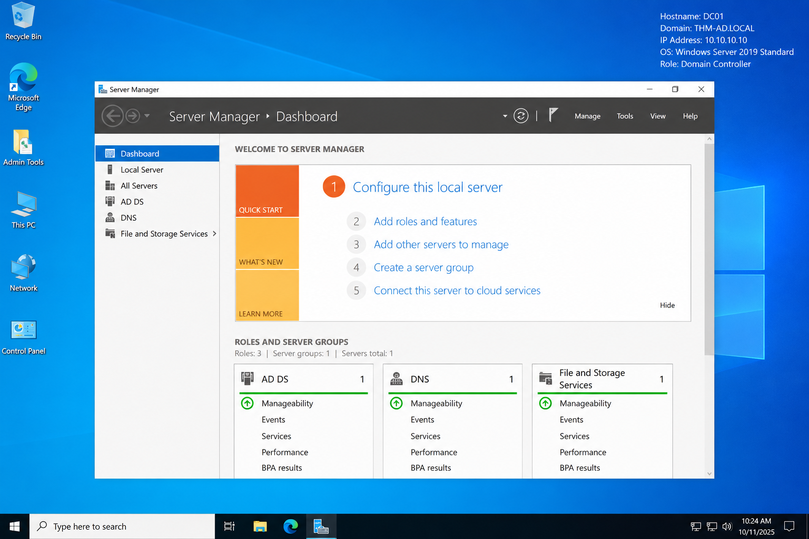

<figcaption>
Figure 2.1 — Windows Server Domain Controller environment used throughout the Active Directory lab. The environment hosts Active Directory Domain Services and administrative management tools.
</figcaption>

</figure>

### Key Concept

A Windows Domain allows administrators to manage a large number of devices and identities through centralized authentication and policy infrastructure instead of maintaining independent local accounts and configurations on every machine.

<div class="key-finding">

<div class="key-finding-title">Security Insight</div>

Centralized authentication improves administrative consistency, access control, auditing, and policy enforcement across enterprise Windows environments.

</div>

---

# Task 3 — Active Directory Objects

## Objective

Explore the structure of Active Directory and understand how users, groups, computers, and Organizational Units are organized within a Windows Domain.

This task introduced **Active Directory Users and Computers (ADUC)**, the primary Microsoft Management Console (MMC) snap-in used for common Active Directory administration.

---

## Active Directory Users and Computers

**Active Directory Users and Computers (ADUC)** provides a graphical interface for managing directory objects inside a Windows domain.

Administrators can use ADUC to:

- Create and delete user accounts.
- Manage security groups.
- Organize Organizational Units.
- Manage computer objects.
- Reset passwords.
- Delegate administrative permissions.

### Administrative Activities

During the lab:

1. Active Directory Users and Computers was opened from the Domain Controller.
2. The domain hierarchy was explored.
3. Built-in containers and Organizational Units were examined.
4. Users, groups, and computers managed by Active Directory were identified.

---

## Evidence — ADUC Console

<figure>

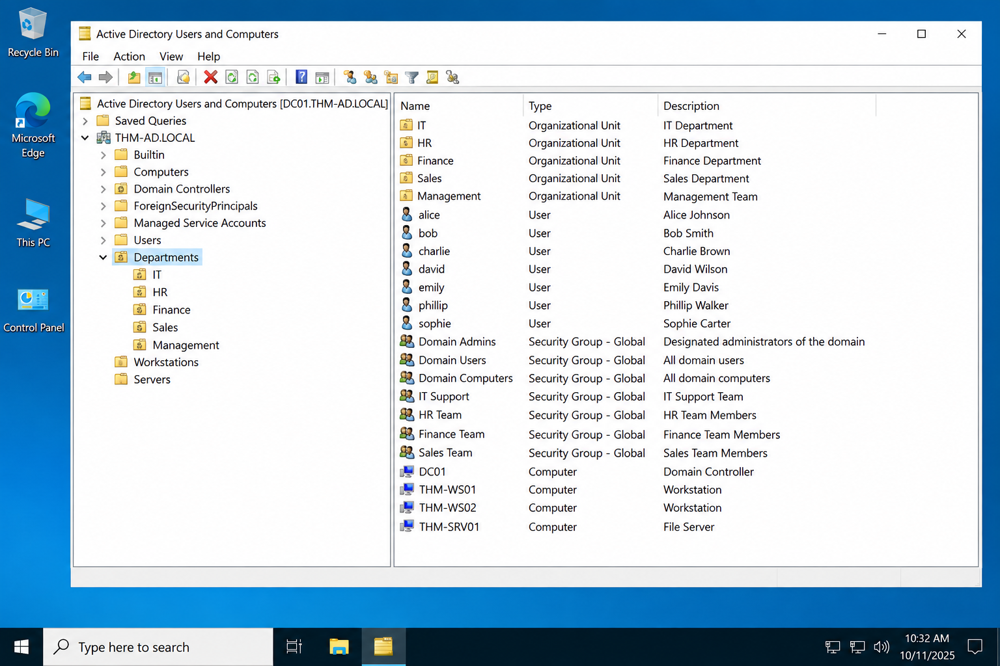

<figcaption>
Figure 3.1 — Active Directory Users and Computers displaying the THM-AD.LOCAL domain hierarchy, Organizational Units, users, groups, and computer containers.
</figcaption>

</figure>

### Understanding the ADUC Interface

| Interface Component | Purpose |
|---|---|
| **Domain Tree** | Displays the hierarchical Active Directory structure |
| **Organizational Units** | Logical containers for directory objects |
| **Users Container** | Contains user objects and security groups |
| **Computers Container** | Default container for newly joined domain computers |
| **Details Pane** | Displays properties of selected directory objects |

---

## Organizational Unit Structure

An **Organizational Unit (OU)** is a logical container that groups users, computers, groups, and other directory objects according to administrative requirements.

Unlike security groups, OUs primarily exist for:

- Administrative delegation.
- Group Policy application.
- Directory organization.

### Example Enterprise OU Design

```text
THM-AD.LOCAL
│
├── Management
├── Finance
├── HR
├── IT
├── Sales
│
├── Workstations
├── Servers
├── Service Accounts
└── Domain Controllers
```

### Administrative Observation

The lab environment contained departmental Organizational Units representing different parts of the organization.

Each department could therefore serve as an administrative and policy-targeting boundary.

---

## Evidence — Organizational Unit Structure

<figure>

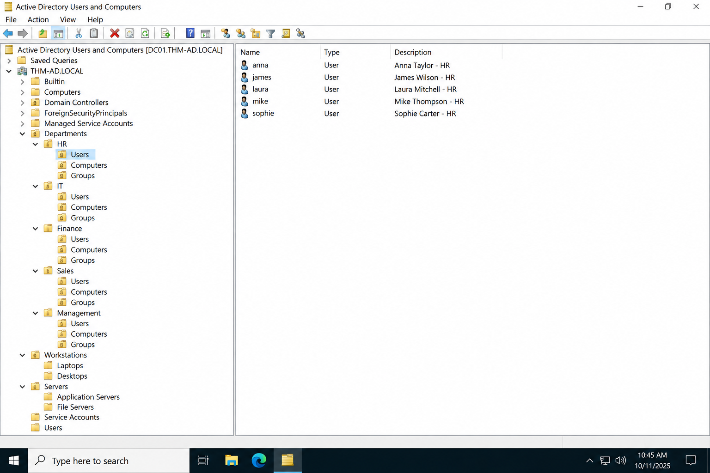

<figcaption>
Figure 3.2 — Organizational Units grouping departmental users and resources into a logical administrative hierarchy.
</figcaption>

</figure>

<div class="callout">

<div class="callout-title">Best Practice</div>

Organize Active Directory based on administrative responsibilities. Separating infrastructure resources such as servers, service accounts, and workstations into dedicated OUs can simplify Group Policy targeting and delegated administration.

</div>

---

## Domain Users Container

### Understanding User Objects

User objects represent identities inside the Windows domain.

A user account contains attributes such as:

| Attribute | Description |
|---|---|
| **Username** | User logon identity |
| **Display Name** | Friendly user name |
| **Email Address** | User email attribute |
| **Department** | Organizational metadata |
| **Group Membership** | Groups to which the account belongs |
| **Security Identifier (SID)** | Unique Windows security identity |

### Administrative Activities

Inside the **Domain Users** container:

- Available user accounts were reviewed.
- User accounts were distinguished from security groups.
- Account properties and descriptions were explored.
- The organization of users inside Active Directory was observed.

### User vs Security Group

| User Object | Security Group |
|---|---|
| Represents an individual identity | Represents a collection of identities |
| Used for authentication | Primarily used for permission assignment |
| Has a password and SID | Has group membership and security permissions |

---

## Evidence — Domain Users Container

<figure>

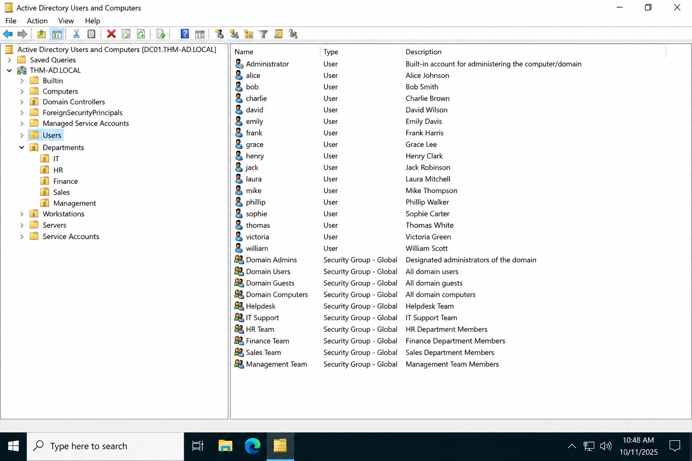

<figcaption>
Figure 3.3 — Domain Users container displaying user accounts and security groups managed inside Active Directory.
</figcaption>

</figure>

---

## Machine Accounts

When a Windows computer joins an Active Directory domain, a corresponding **computer account** is created in the directory.

### Naming Convention

```text
COMPUTERNAME$
```

Example:

```text
TOM-PC$
```

The machine account represents the computer's identity within the domain and participates in the computer's trust relationship with the Domain Controller.

### Key Concepts

- Active Directory stores multiple types of directory objects.
- Organizational Units provide logical administrative structure.
- Users and groups have different purposes.
- Machine accounts represent domain-joined computers.
- ADUC provides a graphical interface for common domain administration.

---

# Task 4 — Managing Users

## Objective

Perform administrative operations on user accounts using Active Directory Users and Computers and Windows PowerShell.

This task simulated a common helpdesk or domain administrator workflow involving intervention on a user account.

---

## User Administration Workflow

### Administrative Scenario

The task involved locating a user account within Active Directory and performing administrative operations without exposing sensitive credential information.

### Workflow

1. Connected to the Domain Controller using Remote Desktop.
2. Opened **Active Directory Users and Computers**.
3. Navigated to the appropriate Organizational Unit.
4. Selected the target user account.
5. Reviewed account properties.
6. Performed password administration.
7. Verified successful authentication.

### Typical Administrative Responsibilities

Common enterprise helpdesk activities include:

- Resetting passwords.
- Unlocking accounts.
- Enabling disabled accounts.
- Updating user attributes.
- Managing group memberships.

---

## Evidence — User Account Management

<figure>

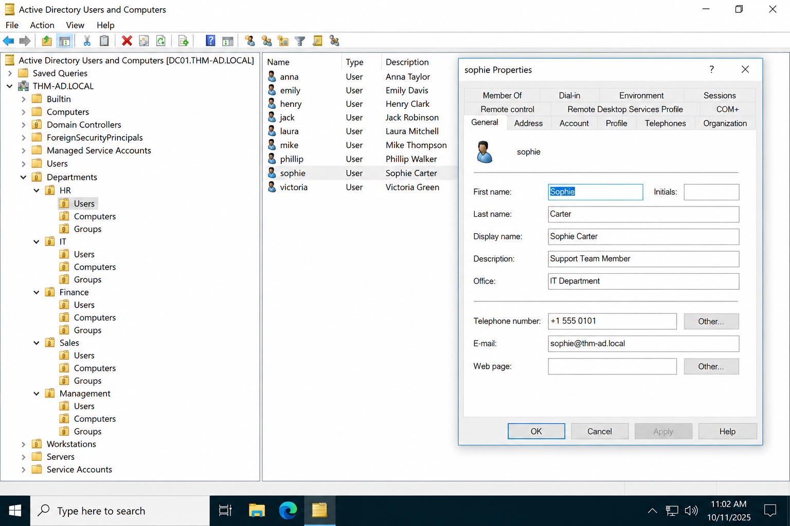

<figcaption>
Figure 4.1 — User account properties displayed inside Active Directory Users and Computers before performing administrative changes.
</figcaption>

</figure>

---

## Reviewing User Properties

The user properties interface provides information through multiple tabs.

| Tab | Purpose |
|---|---|
| **General** | Basic account information |
| **Address** | Office and location information |
| **Account** | Logon configuration and password settings |
| **Member Of** | Group memberships |
| **Profile** | User profile configuration |

---

## Password Administration with PowerShell

### Why PowerShell?

PowerShell provides a repeatable and scriptable interface for Windows and Active Directory administration.

Advantages include:

- Automation.
- Auditing.
- Bulk administration.
- Remote administration.
- Repeatable administrative workflows.

### Password Reset Command

```powershell
Set-ADAccountPassword -Identity <username> -Reset
```

The command resets the password associated with the specified Active Directory account. The actual credential value used during the lab is intentionally not included.

### Additional Administrative Commands

Retrieve user information:

```powershell
Get-ADUser <username>
```

Unlock an account:

```powershell
Unlock-ADAccount -Identity <username>
```

Enable an account:

```powershell
Enable-ADAccount -Identity <username>
```

### Credential Handling

<div class="callout warning">

<div class="callout-title">Credential Redaction</div>

All passwords and sensitive credential values used during the lab have been removed from this portfolio documentation.

```text
Password: [REDACTED]
```

</div>

---

## Evidence — Password Reset Using PowerShell

<figure>

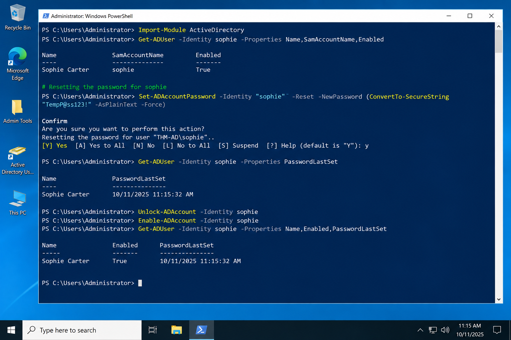

<figcaption>
Figure 4.2 — Windows PowerShell performing an Active Directory password reset operation using delegated administrative privileges.
</figcaption>

</figure>

---

## Administrative Delegation

### What is Delegation?

Administrative delegation allows organizations to grant limited permissions over specific Active Directory objects or Organizational Units without assigning unrestricted **Domain Administrator** privileges.

### Examples

| Role | Delegated Permission |
|---|---|
| **Helpdesk Technician** | Reset passwords and unlock accounts |
| **HR Administrator** | Create and disable employee accounts |
| **IT Support** | Join computers to the domain |
| **Department Administrator** | Manage users inside a specific OU |

### Why Delegation Matters

- Reduces excessive privilege.
- Limits administrative scope.
- Improves accountability and auditing.
- Supports the Principle of Least Privilege.

<div class="key-finding">

<div class="key-finding-title">Security Insight</div>

Routine helpdesk operations should not require unrestricted Domain Administrator privileges. Delegated permissions should be scoped to the actual administrative responsibility.

</div>

---

## Login Verification

After the password administration operation, the updated account credentials were used to verify successful domain authentication.

### Verification Workflow

1. Sign out of the administrator session.
2. Select the managed domain account.
3. Authenticate using the updated credentials.
4. Confirm successful desktop login.

This verification demonstrated that the account modification was accepted by the Active Directory environment and that the updated credentials could be used for authentication.

---

## Evidence — Successful User Login

<figure>

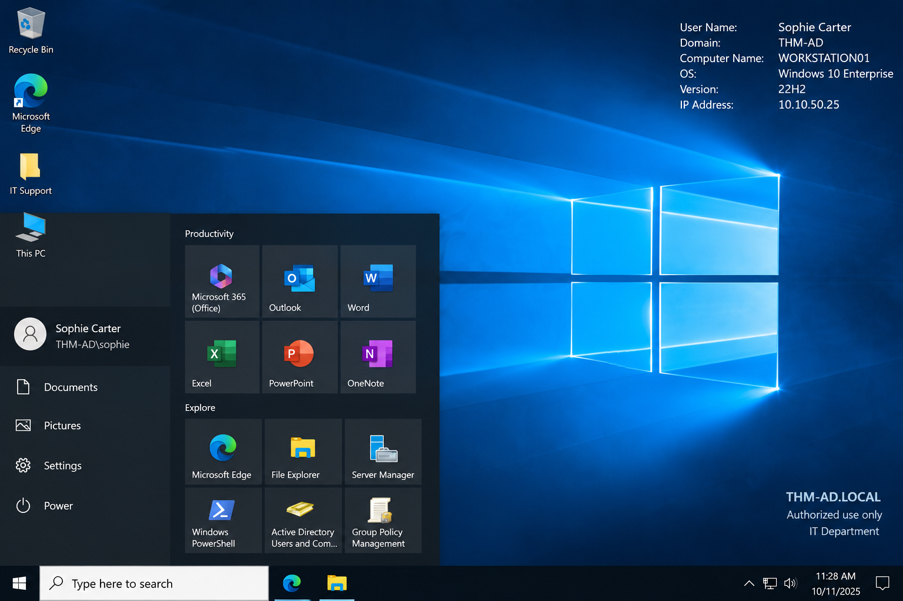

<figcaption>
Figure 4.3 — Successful authentication into a Windows workstation using the managed Active Directory user account.
</figcaption>

</figure>

### Challenge Artifact

Challenge-specific output has been intentionally removed.

```text
Challenge Flag: [REDACTED]
```

### Key Concepts

- User administration can be performed through ADUC or PowerShell.
- PowerShell enables repeatable administrative workflows.
- Delegation supports the Principle of Least Privilege.
- Successful authentication provides verification of the account change.
- Passwords and challenge artifacts should not be exposed in portfolio documentation.

---

# Task 5 — Managing Computers

## Objective

Organize computer objects inside Active Directory by creating a dedicated **Workstations Organizational Unit (OU)** and moving workstation computer accounts into the new administrative container.

This demonstrates how enterprise administrators can structure Active Directory for scalability, policy management, and delegated administration.

---

## Understanding Computer Objects

When a Windows computer joins an Active Directory domain, a corresponding **computer object** is created in the directory.

The computer object represents the machine's identity within the domain and participates in its trust relationship with the Domain Controller.

### Categories of Computer Objects

| Category | Purpose |
|---|---|
| **Workstations** | Employee desktops and laptops joined to the domain |
| **Servers** | Infrastructure systems providing organizational services |
| **Domain Controllers** | Servers providing authentication and directory services |

### Why Separate Computer Objects?

Separating workstations and servers into different Organizational Units allows administrators to:

- Apply different Group Policies.
- Delegate management separately.
- Apply endpoint security configurations.
- Reduce administrative complexity.

---

## Enterprise OU Design Example

```text
THM-AD.LOCAL
│
├── Workstations
│   ├── HR-PC01
│   ├── IT-PC01
│   ├── SALES-PC01
│   └── FIN-PC01
│
├── Servers
│   ├── WEB-SRV01
│   ├── SQL-SRV01
│   └── FILE-SRV01
│
└── Domain Controllers
    └── DC01
```

<div class="callout">

<div class="callout-title">Best Practice</div>

Separating workstation, server, and Domain Controller objects into dedicated Organizational Units can simplify policy targeting, delegated administration, and security management.

</div>

---

## Creating the Workstations OU

A new Organizational Unit named **Workstations** was created to organize endpoint devices separately from servers.

### Procedure

1. Open **Active Directory Users and Computers**.
2. Navigate to the desired parent Organizational Unit.
3. Right-click the parent container.
4. Select **New → Organizational Unit**.
5. Enter the name **Workstations**.
6. Enable protection against accidental deletion.
7. Create the Organizational Unit.

---

## Evidence — Creating the Workstations OU

<figure>

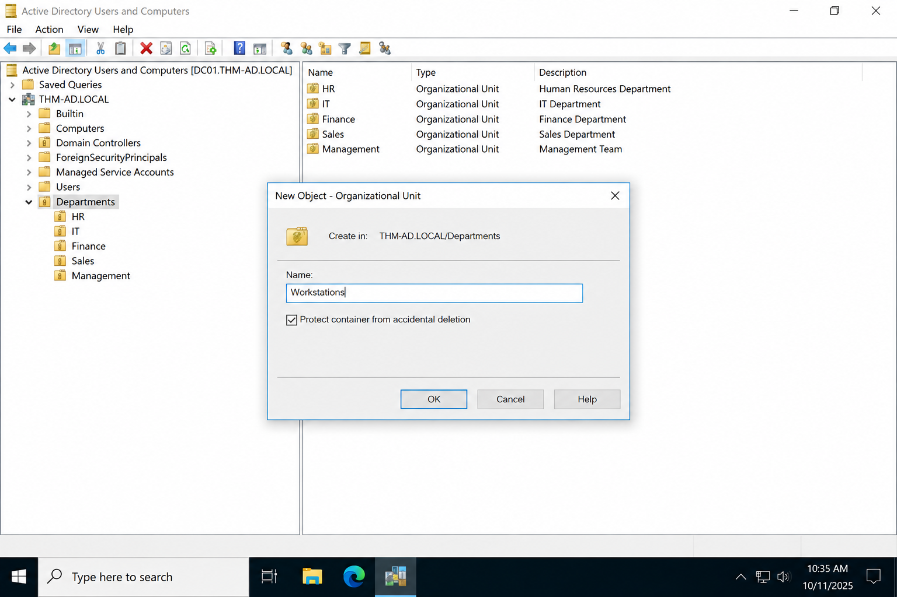

<figcaption>
Figure 5.1 — Creation of a dedicated Organizational Unit named <strong>Workstations</strong> inside the Active Directory hierarchy.
</figcaption>

</figure>

### Accidental Deletion Protection

Enabling protection against accidental deletion provides an additional safeguard against unintentionally removing an Organizational Unit containing production resources.

Benefits include:

- Reducing accidental infrastructure deletion.
- Adding an administrative safety control.
- Encouraging safer Active Directory management.

---

## Moving Computer Objects into the Workstations OU

After creating the Organizational Unit, workstation computer objects were moved from the default **Computers** container into the newly created **Workstations** OU.

### Administrative Workflow

1. Locate workstation computer objects.
2. Select one or more computers.
3. Right-click → **Move**.
4. Select the **Workstations** OU.
5. Confirm the operation.
6. Verify successful placement.

---

## Evidence — Moving Computer Objects

<figure>

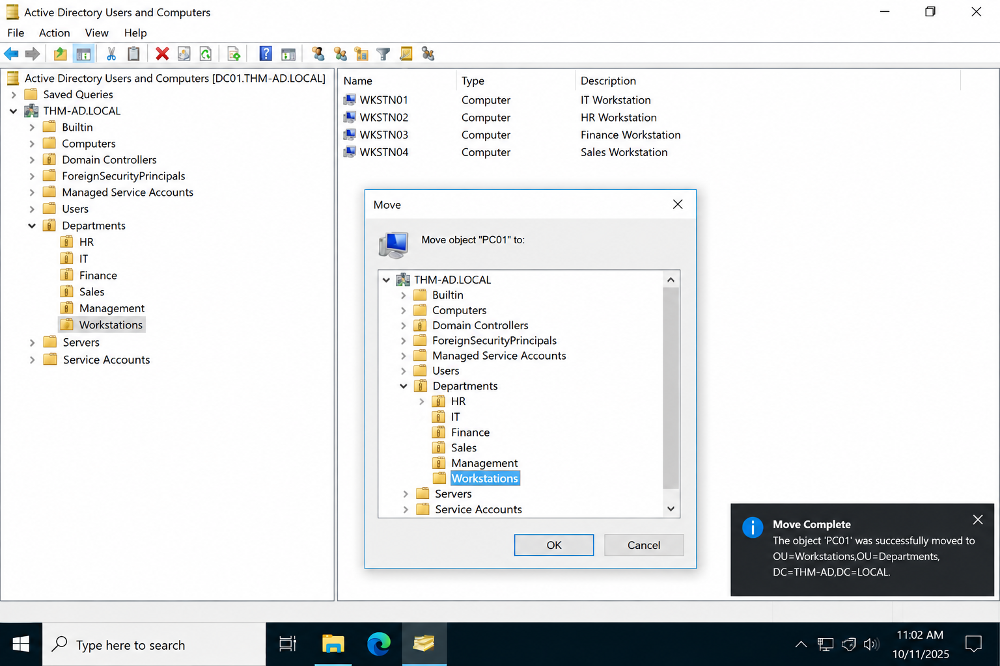

<figcaption>
Figure 5.2 — Workstation computer objects moved into the dedicated Workstations Organizational Unit.
</figcaption>

</figure>

### Administrative Verification

After the operation:

- The Workstations OU contained workstation computer accounts.
- Server objects remained separate.
- Future Group Policies could target workstation devices specifically.

### Benefits

| Administrative Benefit | Description |
|---|---|
| **Centralized workstation management** | Simplifies endpoint administration |
| **Targeted GPO deployment** | Policies can target workstation devices |
| **Delegated administration** | Permissions can be scoped to workstation resources |
| **Reduced complexity** | Provides a cleaner Active Directory hierarchy |

### Key Concepts

- Computer accounts are Active Directory objects.
- OUs provide logical administrative boundaries.
- Separating workstations from servers improves policy management.
- Structured OU design improves Active Directory scalability.

---

# Task 6 — Group Policy Objects & SYSVOL

## Objective

Understand how Windows administrators deploy centralized configuration and security settings using **Group Policy Objects (GPOs)** and how these policies are distributed through **SYSVOL**.

---

## Group Policy Objects

A **Group Policy Object (GPO)** is a collection of Windows configuration settings that administrators can apply to users and computers within Active Directory.

Instead of configuring each workstation individually, administrators can define policy once and apply it across appropriate domain scopes.

### Group Policy Can Configure

| User Policies | Computer Policies |
|---|---|
| Password Policies | Firewall Rules |
| Desktop Restrictions | Windows Defender |
| Login Scripts | BitLocker |
| Folder Redirection | Windows Update |
| Control Panel Restrictions | Security Baselines |

---

## Group Policy Architecture

```text
Administrator
     │
     ▼
Group Policy Management
     │
     ▼
Link GPO to Organizational Unit
     │
     ▼
SYSVOL / Policy Distribution
     │
     ▼
Domain Workstations & Users
```

### Policy Targets

GPOs can be associated with:

| Target | Purpose |
|---|---|
| **Site** | Policies based on Active Directory site topology |
| **Domain** | Policies applicable at domain scope |
| **Organizational Unit** | Policies targeted to specific organizational resources |

---

## Group Policy Processing Order

Windows Group Policy processing follows the **LSDOU** model:

| Order | Meaning |
|---|---|
| **L** | Local Computer Policy |
| **S** | Site Policy |
| **D** | Domain Policy |
| **OU** | Organizational Unit Policy |

Policies processed later can take precedence depending on inheritance, enforcement, filtering, and other Group Policy configuration.

---

## Group Policy Inheritance

Organizational Units can inherit policies from parent containers unless inheritance is blocked or other policy configuration changes the resulting processing behavior.

### Example

```text
Domain Policy
     │
     ▼
Departments OU
     │
     ├── HR OU
     ├── Finance OU
     └── IT OU
```

This hierarchical model helps administrators establish broad policies while allowing more specific policy configuration at lower levels.

---

## Group Policy Management Console

The **Group Policy Management Console (GPMC)** is Microsoft's administrative interface for managing Group Policy.

Administrators use GPMC to:

- Create new GPOs.
- Link GPOs to Organizational Units.
- View inheritance.
- Configure delegation.
- Back up and restore policies.
- Troubleshoot policy application.

---

## Evidence — Group Policy Management Console

<figure>

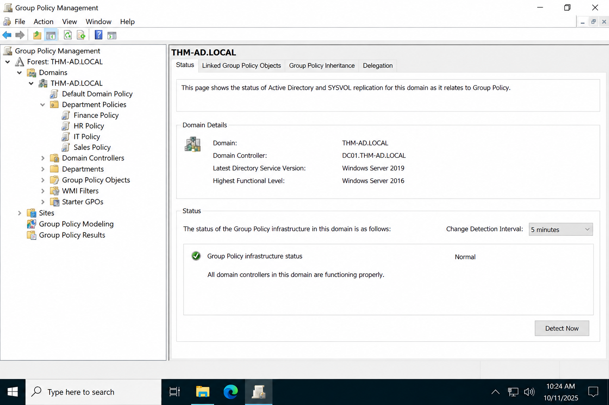

<figcaption>
Figure 6.1 — Group Policy Management Console displaying the Active Directory domain, Organizational Units, and linked Group Policy Objects.
</figcaption>

</figure>

### GPMC Sections

| Section | Purpose |
|---|---|
| **Domains** | Domain-level policy management |
| **Group Policy Objects** | Available GPOs |
| **Organizational Units** | Policy targets |
| **Delegation** | Permission management |
| **Group Policy Results** | Policy troubleshooting |

---

## SYSVOL — Group Policy Distribution

**SYSVOL** is a shared directory hosted on Domain Controllers and is used to distribute domain-wide files such as Group Policy-related data and logon scripts.

### Default SYSVOL Location

```text
C:\Windows\SYSVOL\sysvol\
```

### Contents

The documentation identifies the following types of content associated with SYSVOL:

- Group Policy Objects.
- Login scripts.
- Administrative templates.
- Policy configuration files.

### Why SYSVOL Matters

SYSVOL is an important component of domain policy distribution.

Without functioning SYSVOL infrastructure:

- Group Policy distribution can fail.
- Login scripts can fail to reach clients.
- Domain configuration can become inconsistent.

### SYSVOL Distribution Model

```text
Domain Controller
     │
     ▼
SYSVOL Shared Folder
     │
     ▼
Domain Computers
     │
     ▼
Group Policy Refresh
```

---

## Group Policy Refresh

Domain computers periodically refresh applicable policies.

| Target | Policy Behavior |
|---|---|
| **Computers** | Periodically refresh computer policies |
| **Users** | Apply user-specific policies during login and scheduled refresh |

---

## Evidence — SYSVOL Directory

<figure>

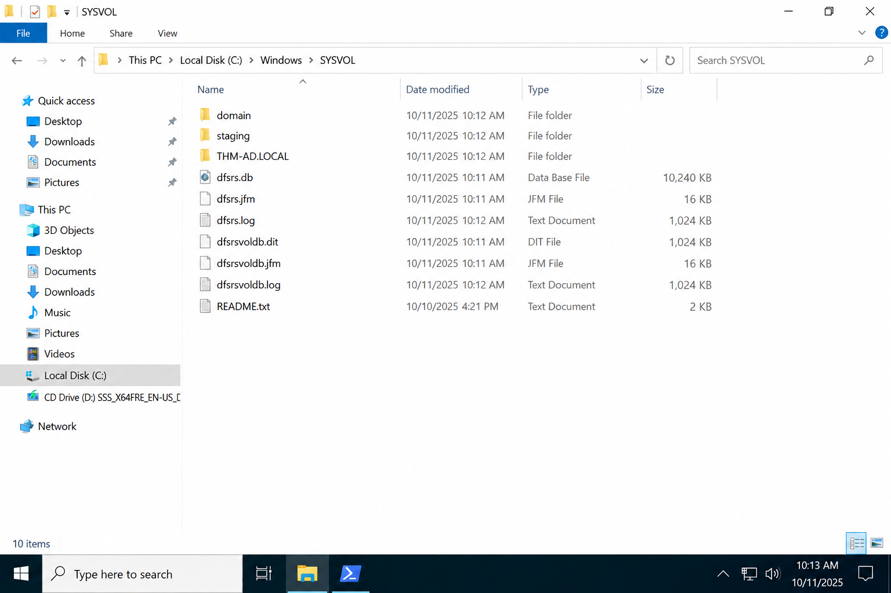

<figcaption>
Figure 6.2 — Windows File Explorer displaying the SYSVOL directory structure used for Group Policy storage and distribution.
</figcaption>

</figure>

---

## Administrative Importance of SYSVOL

| Feature | Why It Matters |
|---|---|
| **Shared Folder** | Provides domain policy and script distribution |
| **Replication** | Helps synchronize SYSVOL contents between Domain Controllers |
| **GPO Storage** | Contains Group Policy-related files |
| **Login Scripts** | Provides centralized script distribution |

### Group Policy Security Best Practices

#### Apply GPOs to Appropriate Organizational Units

Avoid applying unnecessary policies at the domain root when more specific targeting is appropriate.

#### Test Policies Before Production

Validate GPO behavior before deploying broadly.

#### Use Security Filtering

Restrict policy application to intended users and computers where appropriate.

#### Limit GPO Modification Permissions

Only trusted administrators should be able to modify production Group Policies.

<div class="key-finding">

<div class="key-finding-title">Security Insight</div>

Unauthorized modification of a Group Policy can affect many users or systems simultaneously. Protecting GPO modification permissions is therefore an important Active Directory security control.

</div>

### Key Concepts

- Group Policy provides centralized Windows configuration management.
- GPOs can target Sites, Domains, or Organizational Units.
- SYSVOL supports distribution of Group Policy-related files and scripts.
- Policy inheritance simplifies enterprise administration.
- Proper GPO design improves security and operational consistency.

---

# Task 7 — Authentication

## Objective

Understand how Windows Domain authentication works and compare **Kerberos** and **NetNTLM**, the two authentication mechanisms discussed in the lab.

Authentication is fundamental to Active Directory because users, computers, and services depend on it to establish identity before accessing protected resources.

---

## Kerberos Authentication

**Kerberos** is the default authentication protocol used by modern Windows Active Directory environments.

It provides ticket-based authentication and avoids transmitting the user's plaintext password across the network during normal Kerberos authentication.

### Kerberos Components

| Component | Description |
|---|---|
| **KDC — Key Distribution Center** | Authentication infrastructure running on the Domain Controller |
| **AS — Authentication Service** | Handles the initial authentication exchange |
| **TGT — Ticket Granting Ticket** | Ticket used to request additional service tickets |
| **TGS — Ticket Granting Service** | Issues service tickets for requested services |
| **Service Ticket** | Ticket used to authenticate to a particular service |

### Kerberos Authentication Workflow

```text
User Login
   │
   ▼
Authentication Service (AS)
   │
   ▼
Ticket Granting Ticket (TGT)
   │
   ▼
Ticket Granting Service (TGS)
   │
   ▼
Service Ticket
   │
   ▼
Requested Resource
```

### Why Kerberos Is Preferred

- Passwords are not transmitted as plaintext during normal Kerberos authentication.
- Supports mutual authentication in appropriate service configurations.
- Uses encrypted authentication tickets.
- Provides centralized authentication through the domain.
- Enables Single Sign-On across supported domain services.

<div class="callout warning">

<div class="callout-title">Security Consideration</div>

Kerberos authentication relies on accurate system time. Significant clock differences between clients and the Domain Controller can cause authentication failures.

</div>

---

## Ticket Granting Ticket

The **Ticket Granting Ticket (TGT)** is obtained following successful initial authentication.

Its purpose is to allow the authenticated identity to request additional service tickets without repeatedly performing the initial authentication process.

### TGT Characteristics

- Obtained following successful authentication.
- Stored temporarily by the operating system.
- Used to request additional service tickets.
- Has a configurable lifetime.

---

## Ticket Granting Service

When a user accesses a network resource, Kerberos can use the TGT to obtain a **service ticket** for the requested service.

Examples include:

| Service | Example |
|---|---|
| **SMB** | File shares |
| **LDAP** | Directory services |
| **HTTP** | Web applications |
| **MSSQL** | Microsoft SQL Server |
| **CIFS** | Network file resources |

This ticket-based model enables users to authenticate once and access multiple domain resources without repeatedly providing their password.

---

## NetNTLM Authentication

**NetNTLM** refers to Microsoft's challenge-response authentication mechanisms based on NTLM.

It is retained primarily for compatibility with systems or services where Kerberos cannot be used.

### NetNTLM Workflow

```text
Client
  │
  ▼
Authentication Challenge
  │
  ▼
Challenge Response
  │
  ▼
Server Validation
```

### Important Characteristics

- The password itself is not directly transmitted during the challenge-response exchange.
- The authentication response is derived from credential material.
- It exists largely for compatibility with legacy environments.
- Modern Active Directory environments generally prefer Kerberos where available.

---

## Kerberos vs NetNTLM

| Kerberos | NetNTLM |
|---|---|
| Ticket-based authentication | Challenge-response authentication |
| Default protocol in modern AD environments | Legacy authentication mechanism |
| Supports mutual authentication in appropriate configurations | Primarily validates the client response |
| Designed for modern domain authentication | Maintained for compatibility |
| Preferred when available | Used where Kerberos is unavailable or unsuitable |

---

## Evidence — Windows Authentication Concepts

<figure>

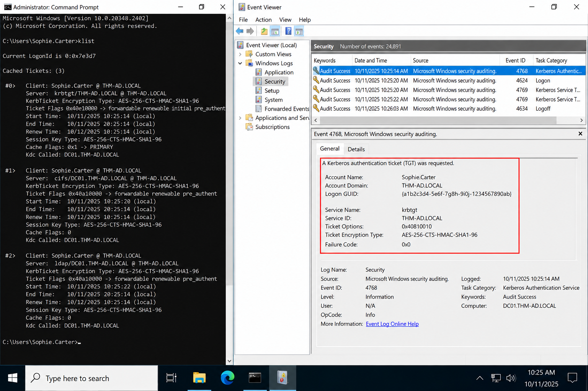

<figcaption>
Figure 7.1 — Kerberos authentication artifacts viewed inside the Windows Active Directory lab environment, demonstrating ticket-based authentication and security event logging.
</figcaption>

</figure>

### Authentication Concepts Learned

- Active Directory uses Kerberos as the preferred authentication protocol in modern domain environments.
- Kerberos uses tickets rather than transmitting plaintext passwords.
- NetNTLM remains available for legacy compatibility.
- Authentication infrastructure is centralized through Domain Controllers.

---

# Task 8 — Trees, Forests & Trust Relationships

## Objective

Understand how Active Directory scales across multiple domains using **Domains**, **Trees**, **Forests**, and **Trust Relationships**.

---

## Domains

A **Domain** is an administrative boundary containing users, groups, computers, and security policies.

Each domain maintains its own:

- Users.
- Computers.
- Security policies.
- Authentication and directory data.

---

## Trees

An **Active Directory Tree** is a hierarchical collection of domains that share a contiguous DNS namespace.

Example:

```text
company.local
│
├── hr.company.local
├── it.company.local
└── sales.company.local
```

### Tree Characteristics

- Shared contiguous namespace.
- Hierarchical domain relationship.
- Automatic transitive trust relationships within the forest's domain structure.

---

## Forests

An **Active Directory Forest** is the highest-level logical structure in Active Directory.

A forest can contain multiple domain trees and therefore support different namespaces.

Example:

```text
company.local

research.local

branch.local
```

### Forest Characteristics

| Feature | Description |
|---|---|
| **Shared Schema** | Common definitions for directory objects |
| **Shared Configuration** | Shared forest-wide configuration information |
| **Multiple Trees** | Supports multiple domain namespaces |
| **Trusts** | Supports authentication relationships between domains |

---

## Trust Relationships

Trust relationships allow identities from one domain to be recognized for access to resources in another trusted domain, subject to permissions.

### Trust Types

| Trust Type | Description |
|---|---|
| **One-Way Trust** | Trust relationship operates in one direction |
| **Two-Way Trust** | Mutual trust relationship between domains |
| **Transitive Trust** | Trust can extend through the domain hierarchy |
| **Non-Transitive Trust** | Trust applies only to explicitly connected domains |
| **Forest Trust** | Supports authentication relationships between forests |

### Trust Relationship Example

```text
+-------------------+
|    Domain A       |
|  Users & Groups   |
+---------+---------+
          │
     Two-Way Trust
          │
+---------+---------+
|    Domain B       |
| Shared Resources  |
+-------------------+
```

Trusts can allow organizations to support resource access across separate administrative domains while maintaining their respective directory structures.

---

## Evidence — Tree, Forest & Trust Structure

<figure>

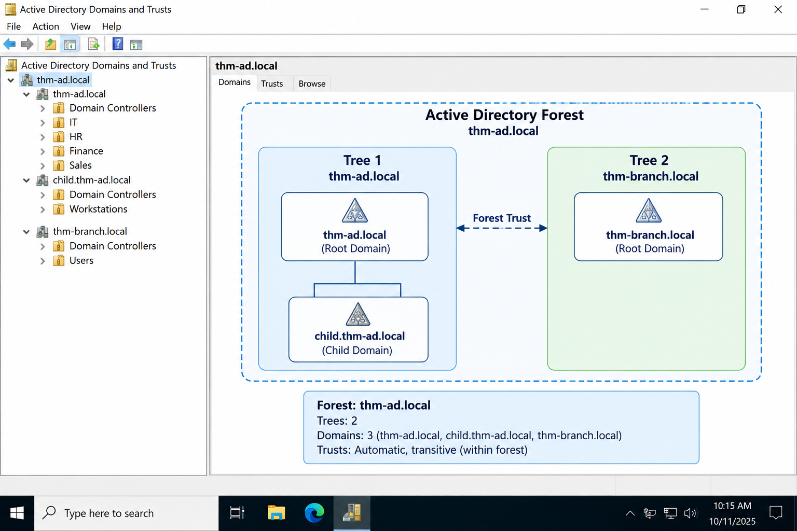

<figcaption>
Figure 8.1 — Illustration of Tree, Forest, Child Domain, and Trust relationships inside an enterprise Active Directory environment.
</figcaption>

</figure>

### Enterprise Importance

Large organizations can use forests, trees, and trusts to support:

- Multiple business units.
- Geographic separation.
- Mergers and acquisitions.
- Shared authentication between organizational environments.

---

# PowerShell Administration

PowerShell provides a powerful scripting interface for Active Directory administration.

The following commands were documented in the original lab material.

## Retrieve User Information

```powershell
Get-ADUser <username>
```

Returns information about an Active Directory user.

---

## Reset User Password

```powershell
Set-ADAccountPassword -Identity <username> -Reset
```

Resets a user's password using the appropriate administrative privileges.

---

## Unlock a User Account

```powershell
Unlock-ADAccount -Identity <username>
```

Unlocks an account after it has become locked.

---

## Enable a User Account

```powershell
Enable-ADAccount -Identity <username>
```

Enables a disabled Active Directory account.

---

## Disable a User Account

```powershell
Disable-ADAccount -Identity <username>
```

Disables an Active Directory user account.

---

## Create an Organizational Unit

```powershell
New-ADOrganizationalUnit -Name "Workstations"
```

Creates a new Organizational Unit named `Workstations`.

### Why PowerShell Matters

| Benefit | Description |
|---|---|
| **Automation** | Repeat administrative tasks consistently |
| **Bulk Administration** | Manage multiple users or computers |
| **Scripting** | Standardize administrative workflows |
| **Remote Administration** | Support remote management scenarios |

<div class="callout warning">

<div class="callout-title">Credential Handling</div>

Passwords and sensitive parameters used during the TryHackMe lab have intentionally been omitted from this documentation.

</div>

---

# Security Best Practices

## Principle of Least Privilege

Grant only the permissions required for a user's responsibilities.

### Benefits

- Reduced attack surface.
- Better auditing.
- Reduced opportunity for privilege abuse.
- Smaller administrative blast radius.

---

## Organizational Unit Design

Separate Active Directory resources into dedicated Organizational Units where appropriate.

Recommended logical categories from the documented lab include:

- Users.
- Workstations.
- Servers.
- Service Accounts.
- Domain Controllers.

This makes policy targeting and delegated administration easier to manage.

---

## Group Policy Security

Because GPOs can affect many systems simultaneously:

- Restrict GPO modification permissions.
- Test policies before deployment.
- Back up important GPOs.
- Review policy inheritance.
- Use appropriate security filtering.

---

## Kerberos Security

Enterprise security practices include:

- Synchronizing system time.
- Disabling unnecessary legacy authentication where feasible.
- Monitoring authentication activity.
- Protecting privileged accounts.

---

## Protect Privileged Groups

Groups requiring particular attention include:

- Domain Admins.
- Enterprise Admins.
- Administrators.
- Backup Operators.

Unexpected membership changes in privileged groups should be investigated.

---

## SYSVOL Security

Security considerations include:

- Restricting write permissions.
- Monitoring replication health.
- Auditing policy changes.
- Securing login scripts.

---

# Key Findings

<div class="key-finding">

<div class="key-finding-title">Finding 01 — Centralized Identity Management</div>

Active Directory centralizes identity, authentication, computer management, and policy administration across Windows domain environments.

</div>

<div class="key-finding">

<div class="key-finding-title">Finding 02 — Administrative Segmentation</div>

Organizational Units provide logical administrative boundaries that can be used for policy targeting and delegated administration.

</div>

<div class="key-finding">

<div class="key-finding-title">Finding 03 — Delegated Administration</div>

Routine administrative operations such as password management can be delegated without granting unrestricted Domain Administrator privileges.

</div>

<div class="key-finding">

<div class="key-finding-title">Finding 04 — Centralized Policy Management</div>

Group Policy provides a mechanism for deploying consistent Windows configuration and security settings across users and computers.

</div>

<div class="key-finding">

<div class="key-finding-title">Finding 05 — Ticket-Based Authentication</div>

Kerberos provides the preferred authentication mechanism for modern Active Directory environments through ticket-based authentication.

</div>

---

# Attack / Administrative Flow

The documented lab is primarily an **Active Directory administration and Windows security fundamentals exercise**, rather than an exploitation-focused CTF.

The practical flow can therefore be summarized as:

<div class="attack-chain">

<div class="attack-step">Windows Domain</div>

<div class="attack-arrow">→</div>

<div class="attack-step">Active Directory</div>

<div class="attack-arrow">→</div>

<div class="attack-step">ADUC Administration</div>

<div class="attack-arrow">→</div>

<div class="attack-step">User Management</div>

<div class="attack-arrow">→</div>

<div class="attack-step">Computer Management</div>

<div class="attack-arrow">→</div>

<div class="attack-step">Group Policy</div>

<div class="attack-arrow">→</div>

<div class="attack-step">Authentication</div>

<div class="attack-arrow">→</div>

<div class="attack-step">Enterprise AD Architecture</div>

</div>

This reflects the actual learning and administrative progression documented in the source material.

---

# Skills Demonstrated

## Windows Administration

- Active Directory Users and Computers (ADUC).
- Organizational Unit management.
- User administration.
- Computer administration.
- Group management.
- Windows Domain administration.

## Identity & Access Management

- Authentication.
- Authorization.
- Administrative delegation.
- Principle of Least Privilege.
- Security groups.
- User and computer identities.

## Windows Security

- Kerberos authentication.
- NetNTLM authentication.
- Group Policy Objects.
- SYSVOL.
- Windows Domain architecture.
- Privileged group protection.

## PowerShell Administration

- User account management.
- Password reset operations.
- Active Directory cmdlets.
- Account enable/disable operations.
- Organizational Unit creation.

## Blue Team Fundamentals

- Windows Domain security.
- Identity management.
- Authentication workflows.
- Group Policy deployment.
- Enterprise Active Directory administration.
- Administrative privilege management.

---

# Lessons Learned

This lab provided practical exposure to the operational side of Microsoft Active Directory rather than only theoretical concepts.

### Technical Knowledge

- Active Directory centralizes identity and access management.
- Domain Controllers provide authentication and directory services.
- Organizational Units organize resources for administration and policy deployment.
- Security Groups simplify permission management.
- Group Policy Objects provide centralized Windows configuration.
- SYSVOL supports distribution of Group Policy-related files and scripts.
- Kerberos is the preferred authentication protocol in modern Windows domains.
- NetNTLM remains relevant for legacy compatibility.
- Trees, Forests, and Trust Relationships allow Active Directory to scale across larger enterprise environments.

### Administrative Skills

- Navigating Active Directory Users and Computers.
- Reviewing user account properties.
- Managing user accounts.
- Performing password administration.
- Creating Organizational Units.
- Organizing workstation computer objects.
- Understanding Group Policy deployment.
- Understanding Kerberos and NetNTLM authentication.
- Using PowerShell for Active Directory administration.

### Cybersecurity Relevance

The concepts practiced in this room are directly applicable to:

- Windows System Administration.
- Identity & Access Management (IAM).
- Security Operations Center (SOC) work.
- Blue Team operations.
- Active Directory security assessments.
- Enterprise Windows security.

<div class="callout info">

<div class="callout-title">Portfolio Relevance</div>

This exercise demonstrates foundational knowledge of how enterprise Windows environments manage identities, endpoints, authentication, authorization, and centralized security policy.

</div>

---

# References

The original documentation identified the following resources for reinforcing concepts introduced during the lab:

- Microsoft Learn — Active Directory Domain Services Documentation.
- Microsoft Learn — Active Directory Users and Computers.
- Microsoft Learn — Group Policy Documentation.
- Microsoft Learn — Kerberos Authentication Overview.
- Microsoft Learn — Active Directory Organizational Units.
- TryHackMe — Active Directory Basics Room.

---

# Repository Structure

```text
Active-Directory-Basics-TryHackMe/
│
├── README.md
│
├── docs/
│   ├── index.md
│   └── assets/
│       ├── figure-2.1-windows-domain-environment.png
│       ├── figure-3.1-active-directory-users-and-computers.png
│       ├── figure-3.2-organizational-unit-structure.png
│       ├── figure-3.3-domain-users-container.png
│       ├── figure-4.1-user-account-management.png
│       ├── figure-4.2-password-reset-powershell.png
│       ├── figure-4.3-successful-user-login-verification.png
│       ├── figure-5.1-creating-workstations-ou.png
│       ├── figure-5.2-moving-computer-objects.png
│       ├── figure-6.1-group-policy-management-console.png
│       ├── figure-6.2-sysvol-directory.png
│       ├── figure-7.1-windows-authentication-concepts.png
│       └── figure-8.1-active-directory-tree-and-forest-structure.png
│
├── Documentation/
│   ├── Active_Directory_Basics_Report.docx
│   └── Active_Directory_Basics_Report.pdf
│
├── Resources/
│   └── notes.md
│
└── LICENSE
```

---

# Responsible Use

This documentation was created for authorized cybersecurity training and CTF environments.

Techniques, administrative procedures, authentication concepts, and security practices described here should only be applied to systems for which you have explicit authorization to test or administer.

---

# Educational Disclaimer

This repository documents concepts and administrative procedures performed during the **TryHackMe — Active Directory Basics** room.

### Included

- Windows Active Directory concepts.
- Administrative workflows.
- PowerShell examples.
- Original documentation and screenshots.
- Educational explanations.
- Windows authentication concepts.
- Group Policy and SYSVOL concepts.
- Enterprise Active Directory architecture.

### Excluded

- Challenge flags.
- Passwords.
- Credentials.
- Sensitive outputs.
- Challenge answers.

Challenge-specific information intentionally redacted in the source documentation remains redacted.

The purpose of this repository is to demonstrate practical understanding of Windows Active Directory administration and security fundamentals while respecting the educational nature of the TryHackMe environment.

---

# Author

**Anurag Revankar**

Cybersecurity Student • Windows Security • Blue Team Fundamentals • Active Directory Administration

---

<div class="ctf-footer">

<strong>CYBERSECURITY CTF PORTFOLIO</strong>

<br>

Research • Practice • Detection • Defense

<br><br>

© Anurag R.

</div>
